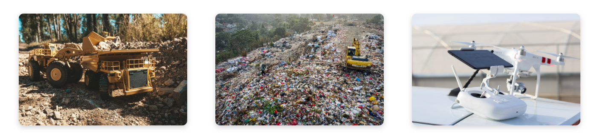

# MLAdy - Autonomous Robots for Everyone <!-- omit in toc -->

Safe, budget-oriented and scalable re-purposing of tried-and-true vehicles for public and industrial applications with reinforcement learning. Or simply put: Use what we have to do more.

MLAdy aims to make an approachable way to utilize artificial intelligence (AI) and robotics for the betterment of humanity, by using cutting edge technology and a no frills attitude.

---

  

---
_Images to paint a picture before going into the about sections below (images provided by [PixaBay](https://pixabay.com/))._

**Motivation**

Most robotics firms develop expensive and custom-made robots entirely from scratch, and as a result adoption of the technology suffers. The main challenge in combining AI and robotics is not the machinery, but the digital brain that operates it. That's why MLAdy exists - to develop a framework that allows for quick, cheap and accessible realization of autonomous robots.

Take downscaled RC and real-size farm and construction vehicles for example; this range of vehicles are made to handle any task on any budget, while being mass produced and widely available industrial solutions tested in the real world for a long time. By using this hardware over from-scratch-solutions, cuts complex and time-consuming development to a minimum.

As a bonus, if the task does not require full size vehicles, RC variants can be used. They are lot safer to develop and deploy than heavy machinery. The other way around? No problem - a generalized abstract reinforcement learning approach will work just as well with custom hardware for complex and specific tasks. This way, MLAdy proposes a way to scale complexity.

MLAdy's long-term vision is to be an AI- and robotics foundation intended for a wide variety of use-cases. To realize this, a clear and concise goal is needed. Optimally something that attracts developers, students and investors to the project.

The environmental challenges of this day and age is as relevant as ever, and garbage is piling up. Hence, the first half of the project will consist of a deployment of a fleet of budget RC vehicles, to collect garbage at the Norwegian University of Life Sciences (NMBU) and surrounding areas. The second part will be commercial implementation of the methods together with industrial partners.

---

**Output**

The final product will be an open hub for end-to-end AI and robotics, consisting of code, tools and methods for real-world application. It will be digitally hosted as open source repositories and resources on the web, accompanied by a network of mentors at NMBU's student innovation center Eik Lab.

This hub and associated members will act as a springboard for robot and AI enthusiastic students (and anyone else interested) to create businesses, educate themselves and do research.

## Table of Contents <!-- omit in toc -->

- [Research and Innovation](#research-and-innovation)
  - [Research and Knowledge](#research-and-knowledge)
    - [Simulation tools](#simulation-tools)
    - [Real world tools](#real-world-tools)
    - [Vision (code - used in simulation and the real world)](#vision-code---used-in-simulation-and-the-real-world)
  - [Level of Innovation](#level-of-innovation)
- [Impacts and Outcomes](#impacts-and-outcomes)
  - [Market Insight and Areas of Application](#market-insight-and-areas-of-application)
    - [Competition](#competition)
  - [Realization strategy](#realization-strategy)
  - [Conditions and Rights](#conditions-and-rights)
  - [Benefit to Society and Sustainability](#benefit-to-society-and-sustainability)
- [Implementation](#implementation)
  - [Project Checklist](#project-checklist)
    - [Possible side projects](#possible-side-projects)
  - [Management, Team and Expertise](#management-team-and-expertise)
    - [Team](#team)
    - [Mentors and key contacts](#mentors-and-key-contacts)
    - [University contributions](#university-contributions)
  - [Budget](#budget)
    - [1. Proof of concept](#1-proof-of-concept)
    - [2. MVP (Minimum Viable Product)](#2-mvp-minimum-viable-product)

## Research and Innovation

### Research and Knowledge

The core team is made up of engineering students and tech enthusiasts at NMBU, engaged in disciplines ranging from mechanical and electrical engineering to application development and data science. All members are active and pioneering participants of a student organization by the name Eik Lab, who recently became an official part of NMBU. It is the University's hub of innovation, with a long track-record of pioneering and bleeding edge technology projects.

The core teams prior experience includes:

- Digitization of industrial documentation
- Research equipment for gene manipulation (CRISPR)
- Detection of mice species using machine learning
- Smart and cloud-connected water fountains
- Full stack web development
- 3D-modelling, animation and rendering

MLAdy will utilize a wide variety of disciplines to create a generally applicable robotics and AI solution to handle almost any task, with rapid prototyping and solid scaling.

The team has experience implementing scalable system architecture, prototyping quickly and working with start-ups, giving a solid foundation to create an intuitive and easy-to-use end product.

The framework will consist of methods and tools facilitating robotic and AI development meant for real application on a budget. The tools themselves may change at any time, but a rough overview of what is applied at the time of writing, is as follows (alternatives sorted by most to least fitting):

#### Simulation tools

_Trained RC car agents driving to detected trash in a simulated environment._

- Alternative 1  
_What is currently in use. Based on Unity and their new reinforcement learning features. MLAdy is developing a method to modify parameters and setup for real world use, and how to apply the toolset in conjunction with other platforms and tools to deploy the simulated agents in the real world. The approach is mostly transferrable to other real-time development platforms and game engines (Unreal Engine for example) if needed, but Unity's interface is superior at the time of writing._
  - Unity (Real-time development platform and game engine)
    - ML Agents (Intuitive tool for reinforcement learning)  
    _Uses PyTorch and ONNX under the hood, which enables wide compatibility. Offers an intuitive simplified introduction to new users, before diving into more advanced AI development._
  - Blender (3D-modelling, free open-source)
  - Fusion 360 (3D-modelling, free student license)
- Alternative 2  
  _Based on NVIDIA's robotics and AI platform. The installation and usage is complex and non-intuitive for users new to the field. It may be the most promising tool for precise and advanced robotics development, but may be overkill for an abstraction approach like the one proposed by MLAdy._
  - NVIDIA Isaac (AI and robotics development platform)
  - Blender (3D-modelling, free open-source)
  - Fusion 360 (3D-modelling, free student license)
- Alternative 3  
  _Based on Unreal Engine. Equivalent to Unity, but requires more external tools to do the same job as Unity offers natively. Possible alternative if Unreal Engines AI-tools should improve or Unity no longer is a valid option. As it stands, Unity is a clear winner._
  - Unreal Engine (Real-time development platform and game engine)
  - Reinforcement learning implemented by hand 
  - Blender (3D-modelling, free open-source)
  - Fusion 360 (3D-modelling, free student license)

#### Real world tools

_MLAdy's DonkeyCar for proof of concept training and inference in the real world._

Microcontroller unit (brain)

- Alternative 1  
  _NVIDIA hardware. NVIDIA is the leading supplier of computing units for AI, but also close to a monopoly. Prices are fair as of now, but it may be something to keep in mind as to not get locked in by the platform. Below are the units offered by NVIDIA relevant to this project:_
  - [Jetson Nano 2gb](https://developer.nvidia.com/EMBEDDED/jetson-nano-2gb-developer-kit)
  - [Jetson Nano](https://developer.nvidia.com/EMBEDDED/jetson-nano-developer-kit)
- Alternative 2  
  _Raspberry Pi hardware. Raspberry Pi is a low cost and easy-to-use alternative. Raspberry Pi was an early player in the DIY community, and as a result has more general resources available. It is overall weaker than NVIDIA hardware, and lacks CUDA support, so it is only a viable option if the computing needs are small and necessary tools are not dependent on CUDA (which open AI-related tools seldom are)._
  - [Raspberry Pi 4 Model B](https://www.raspberrypi.org/products/raspberry-pi-4-model-b/)

Sensors

- [MIPI-CSI](https://mipi.org/specifications/csi-2) camera
  - [Raspberry Pi Camera Module v2](https://www.raspberrypi.org/products/camera-module-v2/)  
  _Widely used camera in DIY-projects, so extensive information and guides are available, but any MIPI-CSI-camera will do._
- Gyroscope/accelerometer
  _Both sensors are potential candidates, and should be tested. Easy of installation and use should be prioritized on final selection._
  - [BMI088](https://www.seeedstudio.com/Grove-6-Axis-Accelerometer-Gyroscope-BMI088.html) - [Code](https://github.com/Seeed-Studio/grove.py/blob/master/doc/README.md)
  - [LSM9DS1](https://learn.adafruit.com/adafruit-lsm9ds1-accelerometer-plus-gyro-plus-magnetometer-9-dof-breakout) - [Code](https://learn.adafruit.com/adafruit-lsm9ds1-accelerometer-plus-gyro-plus-magnetometer-9-dof-breakout)

Vehicles

- RC car
  - [DonkeyCar](https://www.donkeycar.com/)  
  _DonkeyCar is an open source autonomous RC car project with great resources to get up and running with a MCU-controlled vehicle. MLAdy has one up and running already, and real world tests for transferring simulated training will be performed in the coming weeks._
- RC wheel loader
  - Any models from [HUINA](https://www.facebook.com/Huinatoys)* or similar
- RC excavator
  - Any models from [HUINA](https://www.facebook.com/Huinatoys)* or similar

*[HUINA](https://www.facebook.com/Huinatoys) is a budget RC-supplier known in online RC-communities for offering solid budget options.

#### Vision (code - used in simulation and the real world)

_Visualization of camera input, trash detection and depth estimation._

Perception is based mainly on camera input. The pipeline being developed by MLAdy is as follows:
- Automatic calibration of input on startup
- Perception loop
  - Input array of pixels from camera
  - Preprocess image as needed
  - Depth estimation  
    _As new papers on depth estimation are coming out frequently, MLAdy uses the fastest available pretrained model with a usable error score (preferably with an open license for commercial use). [AdaBins](https://github.com/shariqfarooq123/AdaBins) is currently being tested, with promising results. The final model will likely be custom trained with a heavily reduced resolution, as speed is prioritized. Deducing depth with remembered depth map and other detection techniques will be attempted to speed up perception further. The current processing time without optimizations is 1-2 seconds._
  - Update traversable areas
    - Classify traversable area in image  
    _MLAdy has trained a custom trash detector with a processing time as low as 2ms, depending on hardware._
    - Construct virtual 3D map of traversable area with depth (relative to the vehicle)
  - Locate trash
    - Object detection
    - Extract depth of object
    - Create vector of target location (relative to the vehicle)

Initially the model's input will be a flattened vector consisting of all gyroscope/accelerometer data, traversable areas and target location. It then outputs how to move the vehicle to achieve its current goal.

This is input may be sufficient for the proof of concept stage, as proved in simulation without real life noise.

By limiting vision sensors to camera only, calibration is streamlined and installation complexity is reduced. Position, orientation and amount of cameras are yet to be decided.

### Level of Innovation

The industry seems stuck on creating expensive and tailored solutions for giant corporations and educational institutions, and most of the innovation is closed source. MLAdy aims to change this, by offering an open platform. 

An open platform will reduce friction associated with development, as all licenses will be free to use until it is applied in a commercial setting, and allow for rapid prototyping for its users. An open platform will give MLAdy an edge over closed source competition by gaining valuable feedback and improvements from the community, which is especially valuable for data-hungry reinforcement learning, while boosting innovation and adoption of autonomous robots by making it budget friendly and easy to use.

As commercial application of the technology is virtually limitless, the threat of competition is limited, and MLAdy and its users will most likely reap more benefits of an open community.

In the long run, applications can include (but are not limited to):

- Construction
- Storage
- Farming
- Logistics
- Search and resources
- Industrial production
- Education
- Maintenance
- Cleaning

Deployment will be faster than other methods, as the core idea is retrofitting tried-and-true vehicles and machinery already in use, bypassing a large amount of development needed for custom-tailored hardware solutions.

The barrier to entry for AI and robotics is high, being expensive and complex, so reducing this to a level that allows for limited prototype implementations may be an effective way of facilitating commercial use. MLAdy hopes to reduce the difficulty of a real life implementation to a level suited for a small team of engineering students. This would provide high-skilled jobs for students before examination and substantial tech-based economic growth.

MLAdy can gain a valuable network assisting the students in this process by acting as mentors, given that projects are successfully implemented and commercial actors are satisfied with the initiative.

## Impacts and Outcomes

The idea was born out of a discussion regarding automation of forklifts at a factory where part of the core team does software development in 2019. Some recent advancements has showed it possible to implement a framework for quick prototyping, enabling implementation in a wide variety of areas.

### Market Insight and Areas of Application

As mentioned previously, conventional areas of utilizing machinery are likely first candidates for early implementation. MLAdy will propose low-risk test projects to potential clients in agriculture, construction, storage and so on, assigning aspiring students (or other fiery souls) to do the implementation. The core team will primarily develop the framework, while guiding and keeping close contact with implementing participants, who will gather valuable real-world data and experience that can feed back to the framework, but are free to join an implementation hands-on.

This method enables dynamic discovery of the most suited clientele to further pursue and focus effort on, offers a huge potential for learning and warms up firms to the idea of applied autonomous robotics.

#### Competition

There are multiple big actors working on robotics:

- [Boston Dynamics](https://www.bostondynamics.com/)
- [ANYbotics](https://www.anybotics.com/)
- [SIASUN](http://www.siasun.com/index.php?m=content&c=index&a=initsa)
- [Clearpath Robotics](https://clearpathrobotics.com/)
- [Fetch Robotics](https://fetchrobotics.com/)
- [Amazon Robotics](https://www.amazonrobotics.com/)
- [Sarcos](https://www.sarcos.com/)
- [Diligent Robotics](https://diligentrobots.com/)
- [Universal Robots](https://www.universal-robots.com/)

...and many more.

Most if not all have started to adopt modern AI.

Robotic and AI software platforms and frameworks:

- [PyRobot (Facebook)](https://github.com/facebookresearch/pyrobot)
- [Isaac (NVIDIA)](https://www.nvidia.com/en-us/deep-learning-ai/industries/robotics/)
- [Webots](https://cyberbotics.com/)
- [Coppelia Robotics](https://www.coppeliarobotics.com/)
- [Marilou](http://www.anykode.com/marilou.php)
- [Gazebo](http://gazebosim.org/)
- [OpenAI Gym](https://gym.openai.com/)
- [Robot Operating System (ROS)](https://www.ros.org/)

**Why MLAdy?**

A common denominator for the aforementioned corporations are their custom, expensive and inaccessible solutions. MLAdy wants to open the technology for young and bright minds that are not currently employed somewhere that grants them access to expensive and proprietary solutions aimed at profit.

MLAdy fills a gap before implementation, by pushing the profit-seeking aspects to after the prototype stage - and replacing it with a learning based approach.

The ventures that spurs out of MLAdy (see [realization strategy](#realization-strategy)) will compete with the rest of the marketplace, but will offer a lower barrier to entry for cautious adopters in the marketplace.

MLAdy will not necessarily compete with other methods, software platforms or frameworks, as it is most often one abstraction level higher - allowing for usage of other tools. The project's goal is primarily to make it as effective as possible to implement AI and robotics.

The closest alternative available is [ROS](https://www.ros.org/), a widely used framework for making software relating to robots.

MLAdy will (at least initially) offer a more opinionated approach, focusing on general application, intuition and easy-of-use, which the core team found somewhat lacking in ROS. The project will be driven by members actively recruiting and guiding participants, while pushing for real world implementations with economic value.

After the initial stages, MLAdy might even be a great addition to ROS, especially for users new to the field.

### Realization strategy

Each successful implementation using the framework gives an opportunity to start a venture with the client in question. As each client and student group will have individual preferences regarding development and implementation pipelines, MLAdy would allow students to be hired directly by the client, do further work freelance or start their own business. The core team is welcome to do the same.

Making MLAdy a private firm would go against its principles and goals. It is better suited as a hub for accessible robotics and AI development, serving a multitude of ventures, all cooperating if they so wish.

### Conditions and Rights

By not commercializing MLAdy directly, new users are free to use educational licenses and free tiers, making learning and development more accessible. Licenses and tiers needed will then be decided for a limited scope for test projects on a per project basis, and readdressed if the project develops to something more permanent.

### Benefit to Society and Sustainability

**Possible upsides**:

+ Accessible AI and robotic development and deployment
+ Quicker adoption of bleeding edge technology
+ Real-world projects for students
+ Low-risk method for firms to test robotics and AI
+ Provides high-skilled jobs
+ High-tech open source code and methods
+ Synergic research projects with other disciplines at NMBU (other universities down the line)
+ Potential for safer autonomous vehicles in commercial applications
+ Freeing up development time and resources

**Possible downsides and challenges**:

- Replaces jobs
- Work-force willingness to adjust
- Safety concerns related to autonomous vehicles

## Implementation

Project start: 1. January 2021

The project is divided into six phases (see the [project plan](#project-plan) for more detailed milestones):

1. Proof of concept  
2021 Q1  
Goal: Prove that real world application can be achieved with abstracted simulated training

1. MVP (Minimum Viable Product)  
2021 Q1-Q2  
Goal: Extend features to perform a complete task (trash removal)

1. Fleet prototype  
2021 Q2-Q3  
Goal: Scale to multiple vehicles, achieve autonomous cooperation with minimal interaction

1. Scale vehicle size  
2021 Q4  
Goal: Scale to true size vehicles for applications not in public areas, e.g. factories and warehouses

1. Implementation project  
2022 Q1-Q3  
Goal: Successfully apply framework in a useful real life application

1. Scale to multiple projects  
2022 Q2-Q3  
Goal: Make framework generally applicable and accessible

All phases will benefit greatly from funding. The most critical parts are the beginning of phase 3 and out, where a multitude of vehicles and equipment is needed.

The proof of concept is already halfway done at the time of writing.

### Project Checklist

- [ ] Proof of concept
  - [x] Simulation
    - [x] Abstract* vehicle simulation  
    _By abstract we mean a simplified generalization with randomized parameters. This will enable the model to understand different vehicle properties and adjust output accordingly._
    - [x] Abstract environment simulation
    - [x] Easy-to-use reinforcement learning
    - [ ] Mental model
      - [x] Simplified mental model (perfect preprocessed data)
        - [x] Target position relative to vehicle
        - [x] Vehicle orientation (relative to gravity)
        - [ ] Traversable area detection
      - [ ] Complex mental model (same as noisy real world implementation)
  - [ ] Transfer simulated learning to the real world
    - [x] Vehicle
      - [x] RC-car equipped with [NVIDIA Jetson Nano](https://developer.nvidia.com/EMBEDDED/jetson-nano-developer-kit) (based on [DonkeyCar](https://www.donkeycar.com/))
    - [ ] Complex mental model
      - [ ] Sensory input
        - [x] Vision
          - [x] Object detection (trash)
          - [x] Depth map
        - [ ] Orientation
          - [ ] Gyroscope
      - [ ] Virtual map
        - [ ] Target position relative to vehicle
        - [ ] Vehicle orientation (relative to gravity)
        - [ ] Traversable area detection
    - [x] Extract learned model for real word application
  - [ ] Train in the real world
  - [ ] Successfully detect and drive to trash
- [ ] MVP
  - [ ] Add abstract excavator and wheel loader vehicles to simulation
    - [ ] Create abstract arm
    - [ ] Add abstract arm to abstract vehicle
  - [ ] Simulated training
    - [ ] Detect trash
    - [ ] Drive to trash
    - [ ] Pick up trash
    - [ ] Place trash where told
  - [ ] Retrofit a microcontroller unit (MCU) and necessary sensors on a radio controlled excavator and/or wheel loader
  - [ ] Real world training
  - [ ] Successfully do steps necessary for removing trash
    - [ ] Detect trash
    - [ ] Drive to trash
    - [ ] Pick up trash
    - [ ] Place trash where told
- [ ] Fleet prototype
  - [ ] Extend sensory inputs
    - [ ] GPS
  - [ ] Scale MVP to deploy a fleet of minimum 10 vehicles cooperating
  - [ ] Charging
    - [ ] Stations
    - [ ] Routines
  - [ ] Autonomous operation with minimal interaction 24/7
- [ ] Scale vehicle size
  - [ ] Successfully use framework on a 1/1 scale vehicle (e.g. forklift, car, wheel loader, excavator)
- [ ] Implementation project
  - [ ] Make deal with a suited candidate for implementation  
  _Some of MLAdy's core members has already contacted their workplace regarding testing at their factory facilities. The contact person likes the idea and will likely propose an implementation when MLAdy is ready._
  - [ ] Formulate detailed plan for implementation
  - [ ] Implement
- [ ] Scale to multiple projects
  - [ ] Recruit more members
  - [ ] Teach new members framework
  - [ ] Acquire new implementation project
  - [ ] Guide new members through the initial implementation process

#### Possible side projects

Side projects can be assigned new members as test cases before a commercial application. This will help map out new potential use-cases and provide a wide variety of scenarios to make the framework as general and robust as possible. A successful side project will serve as a solid reference when finding new clients. These are initially meant to be at a proof of concept level, but can be scaled if deemed fit.

- [ ] Snow removal
- [ ] Agriculture
- [ ] Construction
- [ ] Demolition

### Management, Team and Expertise

The team driving MLAdy consists of engineering students at NMBU, who are all on their second to final year of their master degrees.

#### Team

<table>
  <tr>
    <th>Name</th>
    <th>Role</th>
    <th>Full time equivalent (Project plan)</th>
  </tr>
  <tr>
    <td>Kristian Gunder Kramås</td>
    <td>Technical lead</td>
    <td>100%</td>
  </tr>
  <tr>
    <td>Anders Mathiesen</td>
    <td>Developer (general)</td>
    <td>100%</td>
  </tr>
  <tr>
    <td>Jan Tore Andersen</td>
    <td>Developer (3D-modelling mainly)</td>
    <td>50%</td>
  </tr>
</table>

The table shows core members of MLAdy only, but MLAdy allows everyone to participate and has already received external contributions.

Notable mentions so far includes:

- Uzair Aftab
  - Performance optimizations
- Peter Sundell
  - Ideas for environment recreation
- Simen Sjølie
  - Electrical guidance

With this open approach, MLAdy will be carried on by new members should the core team choose to leave to pursue something else (a possibility considering the core team will have completed their degrees by the end of 2022 Q2).

#### Mentors and key contacts

<table>
  <tr>
    <th>Name</th>
    <th>Contribution</th>
    <th>Workplace/Institution</th>
  </tr>
  <tr>
    <td>Simen Hesleskaug</td>
    <td>Brainstorming and general project guidance</td>
    <td>NMBU</td>
  </tr>
  <tr>
    <td>Kristian Omberg</td>
    <td>Network</td>
    <td>NMBU</td>
  </tr>
  <tr>
    <td>Eirik Størdal</td>
    <td>Industrial production contact</td>
    <td>Trelleborg Offshore Norway</td>
  </tr>
</table>

#### University contributions

<table>
  <tr>
    <th>Contribution</th>
    <th>Description</th>
  </tr>
  <tr>
    <td>Office space</td>
    <td>The core team has free access to work at Eik Lab's workshop at NMBU</td>
  </tr>
  <tr>
    <td>Hardware</td>
    <td>Eik Lab has an inventory of tools and components suited for mockups and prototypes</td>
  </tr>
  <tr>
    <td>Guidance</td>
    <td>NMBU has in-house experts on machine learning, artificial intelligence and data science, who will gladly offer guidance to students doing relevant projects</td>
  </tr>
</table>

### Budget

#### 1. Proof of concept  
  
All components needed can be found at Eik Lab's workshop and borrowed elsewhere.

#### 2. MVP (Minimum Viable Product)  

Some components needed can be found at Eik Lab's workshop and borrowed elsewhere.

The following must be bought:

<table>
  <tr>
    <th>Product</th>
    <th>Price (NOK, no VAT, rounded up to nearest 50)</th>
  </tr>
  <tr>
    <td><a href="https://www.elefun.no/p/prod.aspx?v=49553">Contruck Wheel Loader</a></td>
    <td>350</td>
  </tr>
  <tr>
    <td><a href="https://www.elefun.no/p/prod.aspx?v=49552">Contruck Excavator</a></td>
    <td>350</td>
  </tr>
  <tr>
    <td><a href="https://www.elefun.no/p/prod.aspx?v=42812&fbclid=IwAR04NOApJ50qJLEGSwhzHwDKGs4BU7lwxKjgKhwQA2o652XmzEvi0t7xwWQ">HUINA Wheel Loader with Excavator Arm</a></td>
    <td>500</td>
  </tr>
  <tr>
    <td><a href="https://www.kjell.com/no/produkter/data/raspberry-pi/raspberry-pi-kameramodul-v2-p88053">Raspberry Pi Camera Module v2</a> x 3</td>
    <td>350 x 3</td>
  </tr>
  <tr>
    <td><a href="https://www.computersalg.no/i/7015984/nvidia-jetson-nano-2gb-wifi?utm_source=prisjaktNo&utm_medium=prisjaktNoLINK&utm_campaign=prisjaktNo">Jetson Nano</a> x 3</td>
    <td>900 x 3</td>
  </tr>
  <tr>
    <th>SUM</a></th>
    <th>4950</th>
  </tr>
</table>

Budgets for remaining phases will be decided when seeking further funding.