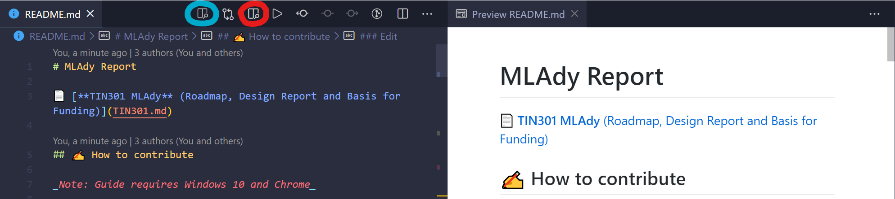

# MLAdy Report

📄 [**TIN301 MLAdy** (Roadmap, Design Report and Basis for Funding)](TIN301.md)

## ✍ How to write

_Note: Guide requires Windows 10 and Chrome_

### Setup and preparation

[Install VSCode](https://code.visualstudio.com/)

[Install Pandoc](https://pandoc.org/installing.html)

Install VSCode extensions:

- [Markdown Preview Enhanced](https://marketplace.visualstudio.com/items?itemName=shd101wyy.markdown-preview-enhanced)
- [Pandoc Citer](https://marketplace.visualstudio.com/items?itemName=notZaki.pandocciter)
- [Spell Right](https://marketplace.visualstudio.com/items?itemName=ban.spellright)
- [Markdown All in One](https://marketplace.visualstudio.com/items?itemName=yzhang.markdown-all-in-one)
- [Markdown Preview GitHub Styling](https://marketplace.visualstudio.com/items?itemName=bierner.markdown-preview-github-styles)

[Install Chrome-extension to quickly get BibTex-references from websites](https://chrome.google.com/webstore/detail/bibtex-entry-from-url/mgpmgkhhbjgkpnanlmlhibjfgpdpgjec?hl=en)  
_Note: This is only to make the initial reference setup faster, you still have to fill in the remaining information_

[Get a feel for NMBU's expected reference-quality](https://www.nmbu.no/en/about-nmbu/library/write-and-cite/styles/examples-nmbu-style)

### Edit

[Edit references](pandoc/references.bib)

[Edit the report](TIN301.md)

To use references in the document type `@`, 


Preview with the magnifier-buttons:  
_Left (thin): Pandoc markdown preview, slow_  
_Right (fat): GitHub markdown preview, fast_

  

### Exporting

Preprocess document:  

```sh
pandoc TIN301.md -o temp.md -A pandoc/bottom.md
```

Export to `.docx`-format (Word) in terminal:

```sh
pandoc temp.md -o TIN301.docx --citeproc --metadata-file TIN301.yaml --reference-doc pandoc/design.docx
```

_[Tip: Pandoc command-line options](https://pandoc.org/MANUAL.html#default-files)_


## 📖 Resources

- [Pandoc manual](https://pandoc.org/MANUAL.html)
- [Pandoc examples](https://pandoc.org/demos.html)
- [Pandoc and citations](https://rmarkdown.rstudio.com/authoring_bibliographies_and_citations.html)
- [Writing GitHub-markdown](https://github.com/adam-p/markdown-here/wiki/Markdown-Cheatsheet)
- [Guide on GitHub markdown to scientific-paper](https://gist.github.com/maxogden/97190db73ac19fc6c1d9beee1a6e4fc8)

## 💡 Tips

- 🚫 Do not use HTML in markdown - it will disappear when exported
- 🕵️‍♂️ Before committing, check GitHub-preview and Pandoc-export to ensure compatibility
- 🧾 The reference section only exists in exports and not the original markdown document
- ❎ Remember to close documents open in other applications before modifying files