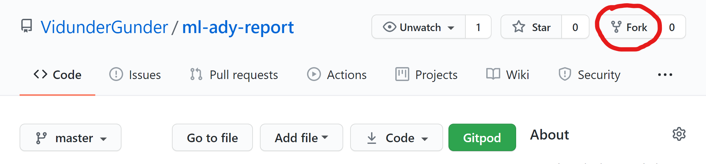
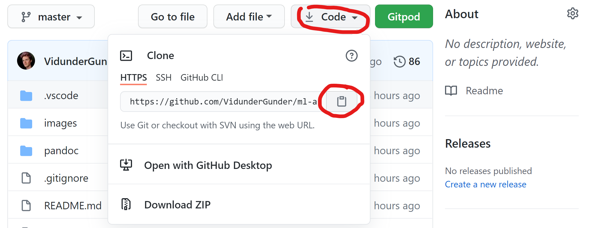
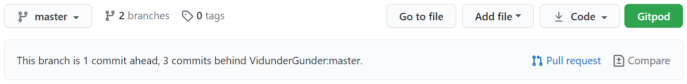
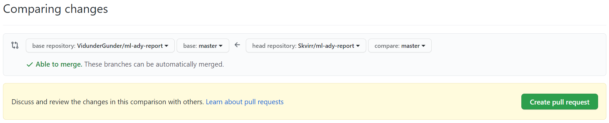

# MLAdy Report <!-- omit in toc -->

📄 [**TIN301 MLAdy** (Roadmap, Design Report and Basis for Funding)](TIN301.md)

## Table of Contents <!-- omit in toc -->

- [How to contribute](#how-to-contribute)
  - [Setup and preparation](#setup-and-preparation)
  - [Edit](#edit)
  - [Share changes](#share-changes)
  - [Exporting](#exporting)
- [Resources](#resources)
- [Tips](#tips)

## How to contribute

_Note: Guide requires Windows 10 and Chrome_

### Setup and preparation

[💾 Install Git](https://git-scm.com/downloads)

[👨‍💻 Install VSCode](https://code.visualstudio.com/)

Enter name and email in a terminal  
_(`View > Terminal` in VSCode or [use PowerShell](https://www.varonis.com/blog/windows-powershell-tutorials/#:~:text=From%20the%20taskbar%2C%20in%20the,tap%20'Run%20as%20administrator'.) directly):_

```sh
git config --global user.name "FIRST_NAME LAST_NAME"
```
```sh
git config --global user.email "MY_NAME@example.com"
```

[📚 Install Pandoc](https://pandoc.org/installing.html)

🔧 Install VSCode extensions:

- [LaTeX Workshop](https://marketplace.visualstudio.com/items?itemName=James-Yu.latex-workshop)
- [Markdown Preview Enhanced](https://marketplace.visualstudio.com/items?itemName=shd101wyy.markdown-preview-enhanced)
- [Pandoc Citer](https://marketplace.visualstudio.com/items?itemName=notZaki.pandocciter)
- [Spell Right](https://marketplace.visualstudio.com/items?itemName=ban.spellright)
- [Markdown All in One](https://marketplace.visualstudio.com/items?itemName=yzhang.markdown-all-in-one)
- [Markdown Preview GitHub Styling](https://marketplace.visualstudio.com/items?itemName=bierner.markdown-preview-github-styles)

[⌚ Install Chrome-extension to quickly get BibTex-references from websites](https://chrome.google.com/webstore/detail/bibitnow/bmnfikjlonhkoojjfddnlbinkkapmldg/related)  
_Note: This is a good extension, but make sure you have all you need and that the information is correct_

🔁 Restart your computer

🍴 Fork project

---



---

🔗 Copy the link to your forked project

---



---

[⏬ Clone your forked project in VSCode](https://code.visualstudio.com/docs/editor/github#:~:text=Cloning%20a%20repository%23,you%20have%20no%20folder%20open)

### Edit

[👩‍🏫 Get a feel for NMBU's expected reference-quality](https://www.nmbu.no/en/about-nmbu/library/write-and-cite/styles/examples-nmbu-style)  

[📝 Edit references](pandoc/references.bib)

[📝 Edit the report](TIN301.md)

To use references in the document type `@` followed by the reference ID.  
_A list of suggestions should appear if project is setup correctly, otherwise copy the ID from `references.bib`._

Example markdown and resulting render:

| Input | Output |
|---|---|
| Reference test [see \@VidunderGunder2021Jan, \@pizza2000identification and \@Storaas2021Jan] | Reference test (see VidunderGunder (2021), Pizza et al. (2000) and Storaas (2021)) |

_Tip: If you want references inside a parenthesis `()`, use brackets `[]` instead, like the example above._

Preview with the magnifier-buttons:  
_Blue, left: **Pandoc** (renders references correctly, slower)_  
_Red, right: **GitHub** (closest to GitHub result, faster)_

---

  

---

### Share changes

[⏫ Push changes to GitHub](https://zeroesandones.medium.com/how-to-commit-and-push-your-changes-to-your-github-repository-in-vscode-77a7a3d7dd02)

🙏 Create a pull request

---





---
### Exporting

📤 Export to `.docx`-format (Word) in terminal:

```sh
pandoc TIN301.md -o TIN301.docx --citeproc --reference-doc pandoc/design.docx
```

[More Pandoc command-line options](https://pandoc.org/MANUAL.html#default-files)


## Resources

- [Pandoc manual](https://pandoc.org/MANUAL.html)
- [Pandoc examples](https://pandoc.org/demos.html)
- [Pandoc and citations](https://rmarkdown.rstudio.com/authoring_bibliographies_and_citations.html)
- [Pandoc tricks](https://github.com/jgm/pandoc/wiki/Pandoc-Tricks#from-markdown-to-markdown)
- [Writing GitHub-markdown](https://github.com/adam-p/markdown-here/wiki/Markdown-Cheatsheet)
- [Guide on GitHub markdown to scientific-paper](https://gist.github.com/maxogden/97190db73ac19fc6c1d9beee1a6e4fc8)

## Tips

- 🚫 Do not use HTML in markdown - it will disappear when exported
- 🕵️‍♂️ Before committing, check GitHub-preview and Pandoc-export to ensure compatibility
- 🧾 The reference section only exists in exports and not the original markdown document
- ❎ Remember to close documents open in other applications before modifying files
