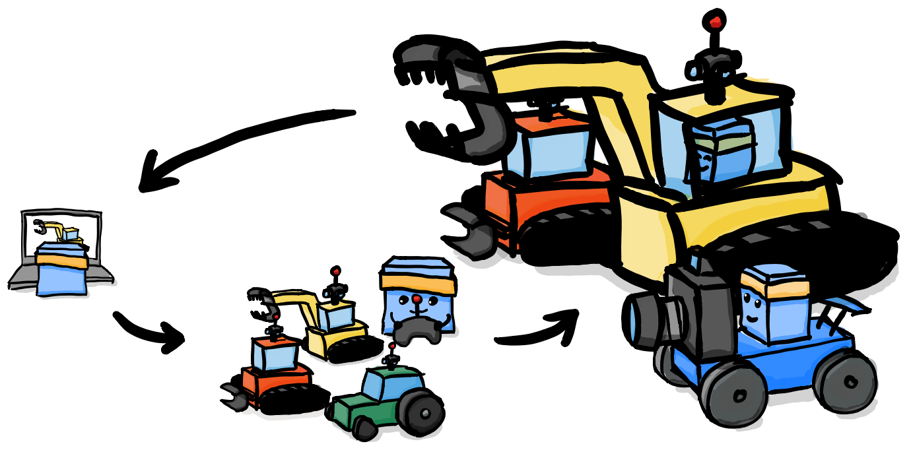
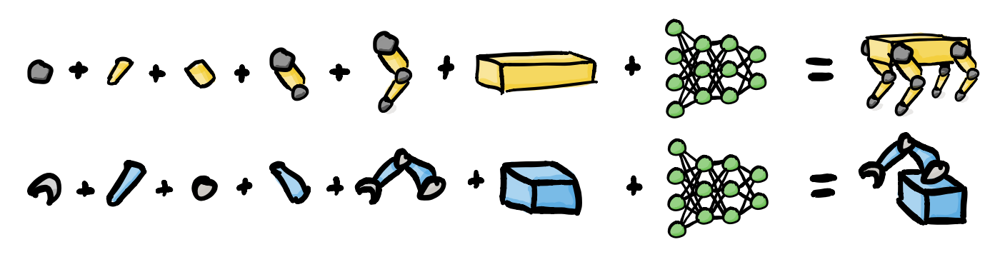
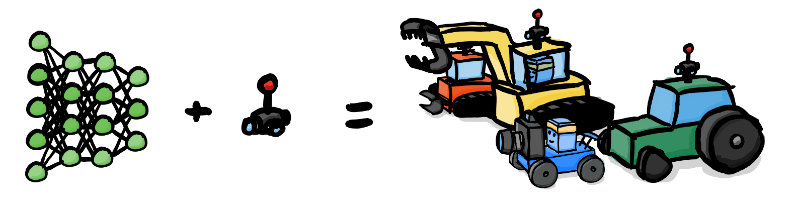
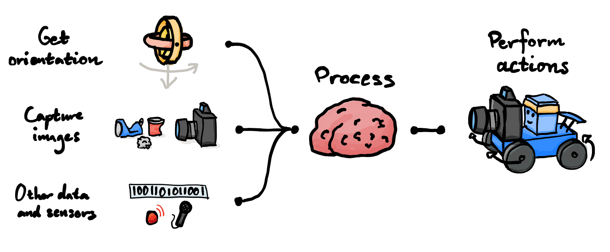
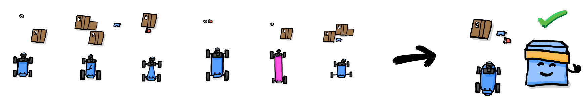
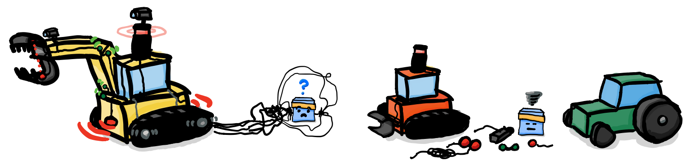
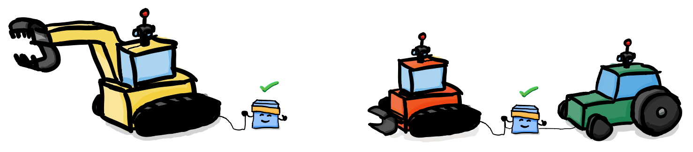
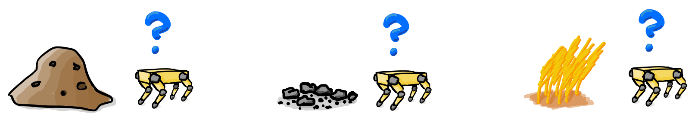
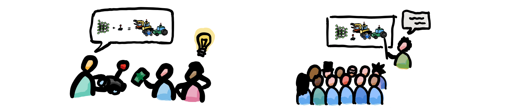

# MLAdy - Retrofitting Autonomy <!-- omit in toc -->

Robotics and AI offers radical improvements in productivity, expenditure and safety, but the market is slow to adopt new technology. Initial investments for early adopters are expensive and high-risk. 

MLAdy offers a budget-oriented way to rapidly autonomize existing vehicles and machinery in public and industrial applications, using a simulation and retrofitting approach with scalable complexity, scope and size.

Early simulations of autonomous vehicles have been successful, major computer vision obstacles have been overcome and real world hardware is soon to be tested.

A pipeline to a market ready implementation is projected to be done before the end of 2022 Q2.

## Table of Contents <!-- omit in toc -->

- [Abbreviations](#abbreviations)
- [Background](#background)
  - [Benefit to Society and Sustainability](#benefit-to-society-and-sustainability)
- [Problem Statement](#problem-statement)
- [Goals and Objectives](#goals-and-objectives)
- [Limitations](#limitations)
- [Project Implementation](#project-implementation)
  - [Team](#team)
  - [Major Milestones](#major-milestones)
- [Theory and Key Concepts](#theory-and-key-concepts)
- [Technical Review](#technical-review)
  - [Simulation tools](#simulation-tools)
  - [Real world tools](#real-world-tools)
    - [Vision (code - used in simulation and the real world)](#vision-code---used-in-simulation-and-the-real-world)
  - [Competition and similar offerings](#competition-and-similar-offerings)
    - [MLAdy's Edge](#mladys-edge)
    - [Threats](#threats)
- [Method - Proof of Concept (Phase 2)](#method---proof-of-concept-phase-2)
  - [Evaluation and results](#evaluation-and-results)
- [Budget (Phase 1-2)](#budget-phase-1-2)
  - [1. Gauge feasibility](#1-gauge-feasibility)
  - [2. Proof of concept](#2-proof-of-concept)
- [Conclusion and Recommendations](#conclusion-and-recommendations)
  - [Next steps](#next-steps)
    - [Checklist](#checklist)
    - [Budget (Phase 3)](#budget-phase-3)
    - [Budget (Phase 4-7)](#budget-phase-4-7)

## Abbreviations

- AI: Artificial intelligence
- RC: Radio controlled
- PoC: Proof of concept
- MVP: Minimum viable product
- MCU: Microcontroller unit
- NMBU: Norwegian University of Life Sciences (Norges Miljø- og Biovitenskapelige Universitet)

## Background

The idea for MLAdy was born out of a discussion regarding automation of existing vehicles at a factory where part of the core team does software development.

Lacking in available technology and competence, the project was put on hold, but recent advancements in reinforcement learning and computer vision has made the challenge surmountable for a small engineering team. These new-found tools and methods enables the creation of a generalized framework for quick robotics and AI prototyping, enabling implementation in a wide variety of areas.

Most robotics firms develop expensive and custom-made robots entirely from scratch, and as a result adoption of the technology suffers. The main challenge in combining AI and robotics is often not the hardware, but the digital brain that operates it. Most tasks already have suitable machinery, all the they need is the autonomy. That's why MLAdy exists - to offer a quick, cheap and accessible way to start using AI and robotics for safer and more effective operation, by focusing on what matters.

Take farm and construction vehicles for example; they are mass produced and widely available industrial solutions tested in the real world for a long time. By using this hardware over from-scratch-solutions, complex and time-consuming development is cut to a minimum.

As a bonus, if the task does not require full size vehicles, scaled down RC variants can be used. They are lot safer to develop and deploy than heavy machinery. The other way around? Not a problem - a generalized reinforcement learning approach will work just as well with custom hardware facing highly complex tasks. This way, MLAdy proposes a way to scale complexity on demand.

MLAdy's long-term vision is to be an AI- and robotics foundation intended for a multitude of use-cases.

In the long run, applications may include (but are not limited to):

- Construction
- Storage
- Farming
- Logistics
- Search and rescue
- Industrial production
- Education
- Maintenance
- Cleaning

### Benefit to Society and Sustainability

**Possible upsides**:

+ Accessible AI and robotic development and deployment
+ Quicker adoption of new technology
+ Real-world projects for students
+ Low-risk method for firms to test robotics and AI
+ Provides high-skilled jobs
+ High-tech open source code and methods
+ Synergic research projects with other disciplines at NMBU (other universities down the line)
+ Potential for safer autonomous vehicles in commercial applications
+ Freeing up development time and resources

**Possible downsides**:

- Replaces jobs
- Work-force willingness to adjust
- Safety concerns related to autonomous vehicles

## Problem Statement

Operations utilizing vehicles, machinery and physical labor are resource-intensive and present serious health risks.

MLAdy offers a highly generalized and scalable way to apply reinforcement learning to existing hardware, offloading direct operation of heavy machinery and physical tasks without the need for hardware replacement.

## Goals and Objectives

MLAdy's overall goal is to speed up the adoption of autonomous robots for the betterment of humanity, by fusing existing hardware with modern AI.

To do this, a framework that allows speedy and scalable implementation with any hardware is needed.

In order to develop such a framework, the following objectives and activities must be met and performed:

- Theoretical framework and technical review
  - Identify key theoretical concepts in order to establish foundational knowledge
  - Research phase for establishing the framework
    - Identify key research work
    - Technical review
      - Identify key experimental work and data
      - Obtain an overview of existing platforms
      - Establish key framework components
      - Identify framework constraints
  - Summary suggesting way forward
- Develop platform 
  - Prototypes
    - PoC (proving end-to-end feasibility of framework)
    - MVP (single vehicle)
    - MVP Fleet (multiple vehicles)
    - MVP Fleet (multiple vehicles)
- Evaluate framework
  - Design and plan out experiment
  - Experimental validation of framework
  - Gauge commercial interest of application of framework
- Recommendations and conclusion
  - Possible improvements
  - Feasible operations to automate
  - Potential clients to pursue

## Limitations

As possible applications of the framework can vary enormously, a clear and concise goal is needed to formulate the framework effectively. This should optimally be something that attracts developers, students and investors to the project, as it will help speed up the process further and increase overall chances of success.

The environmental challenges of this day and age is as relevant as ever, and garbage is piling up. Hence, MLAdy has decided that the beginning stages of the project will consist of a deployment of a fleet of budget RC vehicles to collect garbage at the Norwegian University of Life Sciences (NMBU) and surrounding areas.

Further limiting this, a proof of concept is proposed: Simulating a vehicle able to detect and drive to trash, and use a trained model to do the same task in the real world.

This is to quickly test if the technology is ready and the approach is achievable. If this is a success, the project may be continued on a trajectory proposed in [next-steps](#next-steps).

## Project Implementation

The team driving MLAdy consists of engineering students at NMBU, who are all on their second to final year of their master's degree.

### Team

<table>
  <tr>
    <th>Name</th>
    <th>Role</th>
    <th>Full time equivalent (Project plan)</th>
  </tr>
  <tr>
    <td>Kristian Gunder Kramås</td>
    <td>Technical lead</td>
    <td>100%</td>
  </tr>
  <tr>
    <td>Anders Mathiesen</td>
    <td>Developer (general)</td>
    <td>100%</td>
  </tr>
  <tr>
    <td>Jan Tore Andersen</td>
    <td>Developer (3D-modelling mainly)</td>
    <td>50%</td>
  </tr>
</table>

The table shows core members of MLAdy only, but MLAdy welcomes contributions from people interested in the project. Notable mentions so far includes:

- Uzair Aftab
  - Performance optimizations
- Peter Sundell
  - Ideas for environment recreation
- Simen Sjølie
  - Electrical guidance

### Major Milestones

Project start: 1. January 2021

Based on stated goal and objectives, the project is divided into two phases (see [next-steps](#next-steps) for further development and more phases).

For safety, ease-of-development and budget-friendliness, RC-scale vehicles will be used for proof of concept.

1. Gauge feasibility  
2021 Q1  
Goal: Create overview of existing technology and competition 

   - [x] Existing technology
   - [x] Competition

1. Proof of concept  
2021 Q1  
Goal: Prove that real world application can be achieved with abstracted simulated training

   - [ ] Simulation
   - [ ] Transfer to reality and successfully detect and drive to target

At the time of writing, feasibility study is completed, while the proof of concept is approximately halfway done (see [method](#method---proof-of-concept-phase-2) for detailed steps and progress at the time of writing).

## Theory and Key Concepts

_Note: If no source is cited, definition is formulated by the core team._

**Artificial Intelligence**

[**Investopedia** defines artificial intelligence as follows](https://www.investopedia.com/terms/a/artificial-intelligence-ai.asp#:~:text=Artificial%20intelligence%20(AI)%20refers%20to,as%20learning%20and%20problem%2Dsolving.): 

> Artificial intelligence (AI) refers to the simulation of human intelligence in machines that are programmed to think like humans and mimic their actions. The term may also be applied to any machine that exhibits traits associated with a human mind such as learning and problem-solving

**Neural Network**

A neural network is an interconnected web of nodes, each layer consisting of weights and biases affecting how input to the network will be transformed to an output.

**Machine Learning**

[**TechTarget**'s definition of machine learning](https://searchenterpriseai.techtarget.com/definition/machine-learning-ML#:~:text=Machine%20learning%20(ML)%20is%20a,to%20predict%20new%20output%20values.):

> Machine learning (ML) is a type of artificial intelligence (AI) that allows software applications to become more accurate at predicting outcomes without being explicitly programmed to do so. Machine learning algorithms use historical data as input to predict new output values.

**Classification**

Classification is a way of organizing input/stimuli into categories.

**Training (Machine Learning)**

Updating weights and biases in a neural network. Can be done supervised (with given solutions), unsupervised (figuring out relationships, context or categories by itself) or with reinforcement (based on rewards and penalties for consequences).

**Inference (Machine Learning)**

Using a trained model to get an output based on an input.

**Agent (Intelligent Agent - Machine Learning)**

An agent is something autonomous independently acting in an environment.

**Reinforcement Learning**

Reinforcement learning is a way to utilize machine learning to reinforce an agents behaviors in an environment, based on rewards and penalties.

**Model (Machine Learning)**

A multi-input and multi-output function, most commonly consisting of a conventional neural network, created (trained) with machine learning techniques.

**Transfer Learning**

Using part of a model to train a new model. For example, the introductory layers of object detection is often extracting fundamental features, and can be used to detect cats or dogs, depending on the following layers.

**Composition Learning**

A form of composition, where multiple machine learning models can be connected to each other. An example is a classification model that finds traversable areas, feeding the output to a behavior decision model, that activates a model responsible for movement, if it decides to move.

**Computer Vision**

Using sensory input (often for some wavelength - camera, lidar, radar) to perceive. Concept can be extended to producing a mental model or map.

A mental model may be useful for reinforcement learning agents, as it provides a deeper understanding of inputs and outputs, as well as a better foundation for developers to assign rewards and other logic.

**Object Detection (Computer Vision)**

Classifying and locating objects in images. 

**Depth Estimation (Computer Vision)**

Estimation of distance from camera to surface area. 

**Retrofitting**

To apply something new to an existing object.

**Real-Time Development Platform**

Software made for real-time simulation. May be interchanged with the term "game engine", depending on application of the software.

**Robotics**

[**Britannica**'s definition](https://www.britannica.com/technology/robotics):

> Design, construction, and use of machines (robots) to perform tasks done traditionally by human beings.

**Scalability**

[According to **Investopedia**](https://www.investopedia.com/terms/s/scalability.asp):

> Scalability is a characteristic of an organization, system, model, or function that describes its capability to cope and perform well under an increased or expanding workload or scope. A system that scales well will be able to maintain or even increase its level of performance or efficiency even as it is tested by larger and larger operational demands.

**Simulation**

Scoped recreation or imitation of the real world. In this case, digitally on a computer. May be used to prepare for real world scenarios or gain insight.

**Up-to-date papers and code**

To keep up with and utilize the rapid development in the field of AI, computer vision and robotics, MLAdy is daily updating methods based on the newest available research and implementations. The two main hubs used are [PapersWithCode](https://paperswithcode.com/) and [GitHub](https://github.com/).

## Technical Review

Creation of an autonomous vehicle capable of driving to trash can be divided into three separate tasks: Get data, process and act.

These tasks are looped until the current goal is achieved.

Data is obtained with sensors, processed by a composition of neural nets and performed with connected hardware.

The core of MLAdy is the processing. Processing is done by an agent. The proof of concept is limited to one agent, who is only capable of finding and traversing to trash. 

Usually an agent is conceptualized as the entire vehicle, but to illustrate MLAdy's approach, a blue mascot is used to make it clear that the agent is a driver or operator that can handle a multiple different vehicles (the design is an homage to the [box agents used in Unity's basic examples for ML Agents](https://github.com/Unity-Technologies/ml-agents)).

An agent trained with homogenous environments and features, will only handle a limited set of tasks, and respond badly to new situations.

That's why AI developers tend to challenge their agents with a range of scenarios, dynamic environments, randomness and noise. MLAdy extends this approach to the agent's vehicle, to train a generalized driver.

This approach automatically prepares the agent for unforeseen consequences as well, such as flat tires and missing or stuck parts. 

Simulation is only valuable if applicable in real world scenarios, so simulated and real systems must be designed to compliment the same network of neural nets. If simulated training is applicable for the downscaled RC-car used in the proof of concept, the same model could be used on a one-to-one scale vehicle with some further transfer training.

### Simulation tools

Simulation can boost reinforcement learning by orders of magnitude, as it quickly generates models suitable for transfer learning in the real world and eliminates friction related to hardware and environment in the initial stages.

This is what most of MLAdy's edge stems from. A solid simulation with well scoped randomness, dynamic variables and scenarios will enable training of a superior general driver. Most companies focus training on specific hardware, while MLAdy tries to make all agents trained as general as possible by training on abstractions with automatically changing variables, instead of precise models.

With a well defined abstraction injected with noise, randomization and variations, precision requirements for physics and imitation of hardware and environments are drastically reduced, as the trained model has learned to adapt to any features of vehicle and environment.

  

  <i>Simulated generic RC car with adjustable features including weight, center of gravity, drag, friction, springs, dimensions, power to independent wheels and more (design is an homage to ML Agents' box characters by Unity)</i>

MLAdy has defined three possible toolsets for simulation:

- Alternative 1  
_What is currently in use. Based on Unity and their new reinforcement learning features. MLAdy is developing a method to modify parameters and setup for real world use, and how to apply the toolset in conjunction with other platforms and tools to deploy the simulated agents in the real world. The approach is mostly transferrable to other real-time development platforms and game engines (Unreal Engine for example) if needed, but Unity's interface is superior at the time of writing._
  - Unity (Real-time development platform and game engine)
    - ML Agents (Intuitive tool for reinforcement learning)  
    _Uses PyTorch and ONNX under the hood, which enables wide compatibility. Offers an intuitive simplified introduction to new users, before diving into more advanced AI development._
  - Blender (3D-modelling, free open-source)
  - Fusion 360 (3D-modelling, free student license)
- Alternative 2  
  _Based on NVIDIA's robotics and AI platform. The installation and usage is complex and non-intuitive for users new to the field. It may be the most promising tool for precise and advanced robotics development, but may be overkill for an abstraction approach like the one proposed by MLAdy._
  - NVIDIA Isaac (AI and robotics development platform)
  - Blender (3D-modelling, free open-source)
  - Fusion 360 (3D-modelling, free student license)
- Alternative 3  
  _Based on Unreal Engine. Equivalent to Unity, but requires more external tools to do the same job as Unity natively. Possible alternative if Unreal Engines AI-tools should improve or Unity no longer is a valid option. As it stands, Unity is a clear winner._
  - Unreal Engine (Real-time development platform and game engine)
  - Reinforcement learning implemented by hand 
  - Blender (3D-modelling, free open-source)
  - Fusion 360 (3D-modelling, free student license)

### Real world tools

Generally applicable and budget-oriented hardware and software is needed to be able to retrofit a wide variety of vehicles and machinery. As internal sensory input (joint positions, forces applied etc.) is challenging and complex when working with a wide variety of established vehicles, most inputs will be based on sensors that fit any form factor.

The end hardware solution is ideally one hub containing the majority of sensors, with as few extra nodes placed at critical positions on the vehicle in question.

The system must be able to calibrate sensors automatically, and adjust its mental model if placements are off, equipment is damaged or failures occur.

Microcontroller unit (brain)

- Alternative 1  
  _NVIDIA hardware. NVIDIA is the leading supplier of computing units for AI, but also close to a monopoly. Prices are fair as of now, but it may be something to keep in mind as to not get locked in by the platform. Below are the units offered by NVIDIA relevant to this project:_
  - [Jetson Nano 2gb](https://developer.nvidia.com/EMBEDDED/jetson-nano-2gb-developer-kit)
  - [Jetson Nano](https://developer.nvidia.com/EMBEDDED/jetson-nano-developer-kit)
- Alternative 2  
  _Raspberry Pi hardware. Raspberry Pi is a low cost and easy-to-use alternative. Raspberry Pi was an early player in the DIY community, and as a result has more general resources available. It is overall weaker than NVIDIA hardware, and lacks CUDA support, so it is only a viable option if the computing needs are small and necessary tools are not dependent on CUDA (which open AI-related tools seldom are)._
  - [Raspberry Pi 4 Model B](https://www.raspberrypi.org/products/raspberry-pi-4-model-b/)

Sensors

- [MIPI-CSI](https://mipi.org/specifications/csi-2) camera
  - [Raspberry Pi Camera Module v2](https://www.raspberrypi.org/products/camera-module-v2/)  
  _Widely used camera in DIY-projects, so extensive information and guides are available, but any MIPI-CSI-camera will do._
- Gyroscope/accelerometer
  _Both sensors are potential candidates, and should be tested. Easy of installation and use should be prioritized on final selection._
  - [BMI088](https://www.seeedstudio.com/Grove-6-Axis-Accelerometer-Gyroscope-BMI088.html) - [Code](https://github.com/Seeed-Studio/grove.py/blob/master/doc/README.md)
  - [LSM9DS1](https://learn.adafruit.com/adafruit-lsm9ds1-accelerometer-plus-gyro-plus-magnetometer-9-dof-breakout) - [Code](https://learn.adafruit.com/adafruit-lsm9ds1-accelerometer-plus-gyro-plus-magnetometer-9-dof-breakout)
- Microphone  
_Potential products will be found once it is deemed necessary. Camera and gyroscope is satisfactory at early stages of development._

Vehicles

- RC car
  - [DonkeyCar](https://www.donkeycar.com/)  
  _DonkeyCar is an open source autonomous RC car project with great resources to get up and running with a MCU-controlled vehicle._  
  _MLAdy uses it in real world tests for transferring simulated training._
- RC wheel loader
  - Any models from [HUINA](https://www.facebook.com/Huinatoys)* or similar
- RC excavator
  - Any models from [HUINA](https://www.facebook.com/Huinatoys)* or similar

*[HUINA](https://www.facebook.com/Huinatoys) is a budget RC-supplier [known in online RC-communities for offering solid budget options](https://www.youtube.com/watch?v=jVduwRKrdtM&t=1s).

#### Vision (code - used in simulation and the real world)

Vision will be the most crucial part of the real world system, as it is the basis all other functionality is based on. As the solution should be scalable, cheap and effective, cameras are the only sensors.

Lidar is commonly used in robotics, but as MLAdy has implemented time independent depth perception using monocular input from a camera, the possible gains from an expensive sensor as lidar is miniscule.

Sensor data merging is greatly simplified by perceiving depth based on the same images used in object detection. It allows for simpler and more robust automatic calibration, complimenting MLAdy's approach.

Other sensors may be added for safety features in the later stages of development if deemed fit.

  <i>Visualization of camera input, trash detection and depth estimation.</i>

Perception is based mainly on camera input. The pipeline being developed by MLAdy is as follows:
- Automatic calibration of input on startup
- Perception loop
  - Input array of pixels from camera
  - Preprocess image as needed
  - Depth estimation  
    _As new papers on depth estimation are coming out frequently, MLAdy uses the fastest available pretrained model with a usable error score (preferably with an open license for commercial use). [AdaBins](https://github.com/shariqfarooq123/AdaBins) is currently being tested, with promising results. The final model will likely be custom trained with a heavily reduced resolution, as speed is prioritized. Deducing depth with remembered depth map and other detection techniques will be attempted to speed up perception further. The current processing time without optimizations is 1-2 seconds._
  - Update traversable areas
    - Classify traversable area in image
    - Construct virtual 3D map of traversable area with depth (relative to the vehicle)
  - Locate trash
    - Object detection  
    _MLAdy has trained a custom trash detector with a processing time as low as 2ms, depending on hardware._
    - Extract depth of object
    - Create vector of target location (relative to the vehicle)

Initially the model's input will be a flattened vector consisting of all gyroscope/accelerometer data, traversable areas and target location. It then outputs how to move the vehicle to achieve its current goal.

This input may be sufficient for the proof of concept stage, as proved in simulation without real life noise.

By limiting vision sensors to camera only, calibration is streamlined and installation complexity reduced. Position, orientation and amount of cameras are yet to be decided.

### Competition and similar offerings

There are multiple big actors working on robotics:

- [Boston Dynamics](https://www.bostondynamics.com/)
- [ANYbotics](https://www.anybotics.com/)
- [SIASUN](http://www.siasun.com/index.php?m=content&c=index&a=initsa)
- [Clearpath Robotics](https://clearpathrobotics.com/)
- [Fetch Robotics](https://fetchrobotics.com/)
- [Amazon Robotics](https://www.amazonrobotics.com/)
- [Sarcos](https://www.sarcos.com/)
- [Diligent Robotics](https://diligentrobots.com/)
- [Universal Robots](https://www.universal-robots.com/)

...and many more.

Most if not all have started to adopt modern AI.

Robotic and AI software platforms and frameworks:

- [PyRobot (Facebook)](https://github.com/facebookresearch/pyrobot)
- [Isaac (NVIDIA)](https://www.nvidia.com/en-us/deep-learning-ai/industries/robotics/)
- [Webots](https://cyberbotics.com/)
- [Coppelia Robotics](https://www.coppeliarobotics.com/)
- [Marilou](http://www.anykode.com/marilou.php)
- [Gazebo](http://gazebosim.org/)
- [OpenAI Gym](https://gym.openai.com/)
- [Robot Operating System (ROS)](https://www.ros.org/)

#### MLAdy's Edge

A common denominator for the aforementioned robotics corporations are their custom, expensive and inaccessible solutions, which is often limited in scope.

MLAdy's scalable and retrofitting approach makes robotics more accessible and lowers the risk of initial investments, as well as being more generally applicable. Deployment will be faster than other methods, as retrofitting tried-and-true vehicles and machinery already in use bypasses a large amount of development done by competition.

MLAdy will not necessarily compete with other software platforms or frameworks, as the projects proposed framework is leaning more towards the realization and implementation of available technology - only developing solutions in-house if not available elsewhere. Other platforms will likely be of benefit as tools to make this possible. The project's goal is to make it as effective as possible to implement AI and robotics, not to create a standalone software suite.

The closest available alternatives to MLAdy's proposed framework may be [ROS](https://www.ros.org/) and [PyRobot](https://pyrobot.org/), widely used frameworks for making software relating to robots. MLAdy's framework will offer a more opinionated approach, prioritizing retrofitting, intuition and easy-of-use. Aspects of both frameworks may simplify some aspects down the line, and should then be incorporated into MLAdy's own.

MLAdy might offer parts of its resources to the community, like most technology corporations do (e.g. Facebook's [PyTorch](https://pytorch.org/), [React](https://reactjs.org/) and [PyRobot](https://pyrobot.org/), Tesla's [batteries](https://www.tesla.com/blog/all-our-patent-are-belong-you) and Google's [TensorFlow](https://www.tensorflow.org/) and [gRPC](https://opensource.google/projects/grpc)) as feedback from the open source community can improve the framework.

Active participation by students at NMBU will be a priority given that the first stages (see [checklist](#checklist) and [next-steps](#next-steps)) is a success. Students will gain real life experience in an accessible way, while helping MLAdy push innovation.

MLAdy hopes to reduce the difficulty of implementation to a level where it can hire students to apply the framework in pilot projects. If successful, the colaboration can be turned to a paid service. That way, MLAdy can offer high-skilled jobs to students and substantial tech-based economic growth for local companies with low risk.

#### Threats

As robotics and AI develop, mass production of robots will reduce MLAdy's advantage. Thus, a guiding factor for all decisions should be maintaining the ability for speedy pivots. The framework proposed allows for alternative use by design, and will prepare MLAdy to do more custom solutions, consulting or software for other players in robotics, should the competitive advantage of retrofitting fade.

A generalized retrofit approach will not provide the same native access to sensors and controls as custom solutions, making fail-safes less accessible. This might require extensive experimentation to guarantee safe operation. On the other hand, the approach allows for quickly changing out hardware for safer alternatives (such as downscaled variants of the conventionally used hardware). 

## Method - Proof of Concept (Phase 2)

The proof of concept consists of RC car agent detecting and driving to trash. The environment is a surface with one piece of trash visible to the agent. Training and inference is first simulated on a computer, before it is transferred to the real world. 

  <i>Trained RC car agents driving to detected trash in an early prototype simulation.</i>

With the real world prototype, further training is performed, and when the agent consistently reaches the target on par with a human driver, the proof of concept is deemed complete and a success.

  <i>MLAdy's DonkeyCar for proof of concept training and inference in the real world.</i>

Detailed steps and progress below (**critical steps in bold**):

- [x] Simulation
  - [x] Abstract* vehicle simulation  
  _By abstract we mean a simplified generalization with randomized parameters. This will enable the model to understand different vehicle properties and adjust output accordingly._
  - [x] Abstract environment simulation
  - [x] Easy-to-use reinforcement learning
  - [ ] Mental model
    - [x] Simplified mental model (perfect preprocessed data)
      - [x] Target position relative to vehicle
      - [x] Vehicle orientation (relative to gravity)
      - [ ] Traversable area detection
    - [ ] Complex mental model
      - [x] Sensory input (digital twin of real world implementation)
        - [x] Vision
          - [x] Object detection (trash)
          - [x] Depth map
        - [x] Orientation
          - [x] Gyroscope
      - [ ] Virtual map
        - [ ] Target position relative to vehicle
        - [ ] Vehicle orientation (relative to gravity)
        - [ ] Traversable area detection
  - [x] **Successfully drive to target with simplified inputs**  
  _Incomplete inputs, but the agent had 100% success rate in only minutes of training._
  - [ ] **Successfully drive to target with complex inputs**
- [ ] Transfer simulated learning to the real world
  - [x] Vehicle
    - [x] RC-car equipped with [NVIDIA Jetson Nano](https://developer.nvidia.com/EMBEDDED/jetson-nano-developer-kit) (based on [DonkeyCar](https://www.donkeycar.com/))
  - [x] Environment
    - [x] Flat area
    - [x] Trash
  - [ ] Complex mental model
    - [ ] Sensory input
      - [x] Vision
        - [x] Object detection (trash)
        - [x] Depth map
      - [ ] Orientation
        - [ ] Gyroscope
    - [ ] Virtual map
      - [ ] Target position relative to vehicle
      - [ ] Vehicle orientation (relative to gravity)
      - [ ] Traversable area detection
  - [x] Extract learned model for real word application
- [ ] Train in the real world
- [ ] **Successfully detect and drive to trash**

### Evaluation and results

Criteria for success is that the agent can detect, drive towards and stop directly in front of a target.

Simulation training showed that the simplified input vector of relative position to target and agent orientation was enough for the agent to successfully drive to a randomly spawned trash object with a 100% success rate.

For real world tests, it is required that the simulated model is usable as a starting point for real world training and that the mental model performs similarly in simulation and reality (or is handled equally well by the agent in both cases). That remains to be seen.

## Budget (Phase 1-2)

### 1. Gauge feasibility

No equipment needed.

### 2. Proof of concept
  
All components needed can be found at Eik Lab's workshop and borrowed elsewhere.

(See budgets under [next-steps](#next-steps) for more)

## Conclusion and Recommendations

So far, early testing and development has been a success. An end-to-end pipeline proving the assumptions generalized abstracted simulation is almost complete.  with some real world tests left to be done.

### Next steps

Immediately, the proof of concept should be finalized and documented. If it the trajectory continues and the second phase is deemed a success, the team can move on to the phase 3. 

Development, experimentation and evaluation will be done for each prototype step (3-6), to promote pivoting as necessary. The most critical experiment will be an implementation with an industrial partner.

For safety, ease-of-development and budget-friendliness, RC-scale vehicles will be used up until phase 5.

3. MVP (Minimum Viable Product)  
2021 Q1-Q2  
Goal: Extend features to perform a complete task (trash removal)

4. Fleet prototype  
2021 Q2-Q3  
Goal: Scale to multiple vehicles, achieve autonomous cooperation with minimal interaction

5. Scale vehicle size  
2021 Q4  
Goal: Scale to true size vehicles for applications not in public areas, e.g. factories and warehouses

6. Implementation project  
2022 Q1-Q2  
Goal: Successfully apply framework in a useful real life application

7. Reflection and next-steps  
2022 Q2  
Goal: Document key findings throughout the project and propose possible next-steps

All phases will benefit greatly from funding, as a multitude of vehicles and equipment is needed.

#### Checklist

- [ ] MVP (Phase 3)
  - [ ] Add abstract excavator and wheel loader vehicles to simulation
    - [ ] Create abstract arm
    - [ ] Add abstract arm to abstract vehicle
  - [ ] Simulated training
    - [ ] Detect trash
    - [ ] Drive to trash
    - [ ] Pick up trash
    - [ ] Place trash where told
  - [ ] Retrofit a microcontroller unit (MCU) and necessary sensors on a radio controlled excavator and/or wheel loader
  - [ ] Real world training
  - [ ] Successfully do steps necessary for removing trash
    - [ ] Detect trash
    - [ ] Drive to trash
    - [ ] Pick up trash
    - [ ] Place trash where told
- [ ] Fleet prototype (Phase 4)
  - [ ] Extend sensory inputs
    - [ ] GPS
  - [ ] Scale MVP to deploy a fleet of minimum 10 vehicles cooperating
  - [ ] Charging
    - [ ] Stations
    - [ ] Routines
  - [ ] Autonomous operation with minimal interaction 24/7
- [ ] Scale vehicle size (Phase 5)
  - [ ] Successfully use framework with a one-to-one scale vehicle (e.g. forklift, car, wheel loader, excavator)
- [ ] Implementation project (Phase 6)
  - [ ] Make deal with a suited candidate for implementation  
  _Some of MLAdy's core members has already contacted their workplace regarding testing at their factory facilities. The contact person likes the idea and will likely propose an implementation when MLAdy is ready._
  - [ ] Formulate detailed plan for implementation
  - [ ] Implement
- [ ] Documentation (Phase 7)  
_As the time-frame for documentation coincides with the core team's final semester, this project may be a possible subject for a master's thesis should they still be involved._
  - [ ] Key findings
  - [ ] Next-steps

#### Budget (Phase 3)

Some components needed can be found at Eik Lab's workshop and borrowed elsewhere.

The following must be bought:

<table>
  <tr>
    <th>Product</th>
    <th>Price (NOK, no VAT, rounded up to nearest 50)</th>
  </tr>
  <tr>
    <td><a href="https://www.elefun.no/p/prod.aspx?v=49553">Contruck Wheel Loader</a></td>
    <td>350</td>
  </tr>
  <tr>
    <td><a href="https://www.elefun.no/p/prod.aspx?v=49552">Contruck Excavator</a></td>
    <td>350</td>
  </tr>
  <tr>
    <td><a href="https://www.elefun.no/p/prod.aspx?v=42812&fbclid=IwAR04NOApJ50qJLEGSwhzHwDKGs4BU7lwxKjgKhwQA2o652XmzEvi0t7xwWQ">HUINA Wheel Loader with Excavator Arm</a></td>
    <td>500</td>
  </tr>
  <tr>
    <td><a href="https://www.kjell.com/no/produkter/data/raspberry-pi/raspberry-pi-kameramodul-v2-p88053">Raspberry Pi Camera Module v2</a> x 3</td>
    <td>350 x 3</td>
  </tr>
  <tr>
    <td><a href="https://www.computersalg.no/i/7015984/nvidia-jetson-nano-2gb-wifi?utm_source=prisjaktNo&utm_medium=prisjaktNoLINK&utm_campaign=prisjaktNo">Jetson Nano</a> x 3</td>
    <td>900 x 3</td>
  </tr>
  <tr>
    <th>SUM</a></th>
    <th>4950</th>
  </tr>
</table>

#### Budget (Phase 4-7)

Budgets for remaining phases will be decided when seeking further funding, as needs are uncertain before phase 3 nears completion.