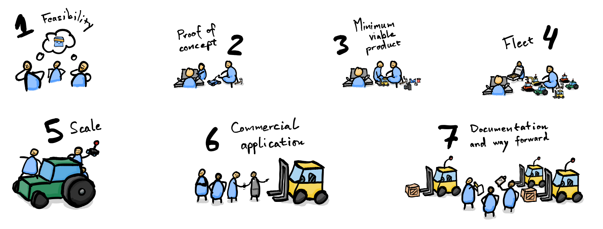

testest
<!-- 
How to use metadata:
https://pandoc.org/MANUAL.html#metadata-variables
-->

# MLAdy - Retrofitting Autonomy <!-- omit in toc -->

## Executive Summary

According to VG (@Myrvang2021Jan) Robotics and AI offers radical improvements in productivity and safety, but the market is slow to adopt new technology. Initial investments for early adopters are expensive and high-risk.

Bridging the gap between legacy hardware and modern robotics, MLAdy offers a budget-friendly way to autonomize existing vehicles, using simulation and retrofitting with scalable size, scope and complexity.

Early simulations have been successful and real world hardware is soon to be tested. A commercial implementation is projected to be complete by the end of Q4 2021.

## TODO:

- [ ] Add [Apollo](https://apollo.auto/) to competitor analysis
- [ ] Proper citation
- [ ] Word theme

## Table of Contents <!-- omit in toc -->

- [Executive Summary](#executive-summary)
- [TODO:](#todo)
- [Abbreviations](#abbreviations)
- [Background](#background)
- [Problem Statement](#problem-statement)
- [Market](#market)
  - [Competition and similar offerings](#competition-and-similar-offerings)
  - [MLAdy's Edge](#mladys-edge)
  - [Challenges](#challenges)
  - [Benefit to Society and Sustainability](#benefit-to-society-and-sustainability)
- [Goals and Objectives](#goals-and-objectives)
- [Limitations](#limitations)
- [Project Implementation](#project-implementation)
  - [Team](#team)
  - [Mentors](#mentors)
  - [University Contributions](#university-contributions)
  - [Commercial Partners](#commercial-partners)
  - [Major Milestones](#major-milestones)
- [Realization Strategy](#realization-strategy)
  - [Position in value chain](#position-in-value-chain)
  - [Business model](#business-model)
    - [Activities](#activities)
    - [Resources](#resources)
    - [Network](#network)
    - [Value propositions](#value-propositions)
    - [Customer segments](#customer-segments)
    - [Channels](#channels)
    - [Customer relationships](#customer-relationships)
    - [Cost structure](#cost-structure)
    - [Revenue streams](#revenue-streams)
  - [Pricing](#pricing)
- [Theory and Key Concepts](#theory-and-key-concepts)
- [Technical Review](#technical-review)
  - [Simulation tools](#simulation-tools)
  - [Hardware](#hardware)
  - [Vision](#vision)
- [Method - Proof of Concept (Phase 2)](#method---proof-of-concept-phase-2)
  - [Evaluation and results](#evaluation-and-results)
- [Budget (Phase 1-2)](#budget-phase-1-2)
  - [1. Gauge feasibility](#1-gauge-feasibility)
  - [2. Proof of concept](#2-proof-of-concept)
- [Conclusion and Recommendations](#conclusion-and-recommendations)
  - [Next steps](#next-steps)
    - [Checklist](#checklist)
    - [Budget (Phase 3)](#budget-phase-3)
    - [Budget (Phase 4-7)](#budget-phase-4-7)
- [Rights and Licenses](#rights-and-licenses)
  - [Intelligent property](#intelligent-property)
  - [Privacy](#privacy)
  - [Key licenses currently in use](#key-licenses-currently-in-use)
- [References](#references)

## Abbreviations

- AI: Artificial intelligence
- RC: Radio controlled
- PoC: Proof of concept
- MVP: Minimum viable product
- MCU: Microcontroller unit
- NMBU: Norwegian University of Life Sciences (Norges Miljø- og Biovitenskapelige Universitet)
- PLM: Product lifecycle management
- CAD: Computer-aided design
- GDPR: General Data Protection Regulation

## Background

The idea for MLAdy was born out of a discussion regarding automation of existing vehicles at a factory where part of the core team does software development.

Lacking in available technology and competence, the project was put on hold, and the members went on to other projects. Recent advancements in reinforcement learning and computer vision, accompanied by broadening and improvement of the team's skillset, now enables the creation of a generalized framework for quick robotics and AI prototyping. With a base of well-thought-out principles for scalability, MLAdy aims to facilitate the use robotics in a wide variety of areas.

Most robotics firms develop expensive and custom-made robots entirely from scratch, and as a result adoption of the technology suffers. In an article (@BibEntry2020Mar) commenting the main challenges in robotics, it is stated that the main challenge in combining AI and robotics is often not the hardware, but the digital brain that operates it. Most tasks already have suitable machinery, all the they need is the autonomy. That's why MLAdy exists - to offer a quick, cheap and accessible way to start using AI and robotics for safer and more effective operation, by focusing on what matters.

Take farm and construction vehicles for example; they are mass produced and widely available industrial solutions tested in the real world for a long time. By using this hardware over from-scratch-solutions, complex and time-consuming development is cut to a minimum.

As a bonus, if the task does not require full size vehicles, scaled down RC variants can be used. They are lot safer to develop and deploy than heavy machinery. Additionally, the generalized approach will work just as well with custom hardware facing highly complex tasks. This way, MLAdy proposes a way to scale complexity on demand.

MLAdy's long-term vision is to be an AI- and robotics foundation intended for multiple use-cases. In the long run, applications may include (but are not limited to):

- Construction
- Storage
- Farming
- Logistics
- Search and rescue
- Industrial production
- Education
- Maintenance
- Cleaning
- Mining
- Residential
- Energy
- Infrastructure

## Problem Statement

Operations utilizing vehicles, machinery and physical labor are resource-intensive and present serious health risks.

MLAdy offers a highly generalized and scalable way to apply reinforcement learning to existing hardware, offloading direct operation of heavy machinery and physical tasks without the need for hardware replacement.

## Market

Both the AI and robotics market are in rapid growth, and the technologies are being used in most if not all industries in one form or another; [cars can self-drive](https://www.tesla.com/autopilot)(@BibEntry2021Jan), [trading is done with bots using neural networks](https://github.com/microsoft/qlib)(@microsoft2021Jan) and manufacturing is automated ([even with custom designs](https://blog.robotiq.com/7-things-you-need-to-know-about-mass-customization-with-robots)(@Owen-Hill2019Oct)).

Global valuations of AI and robotics:
- Artificial intelligence  
  [USD 39.9 billion in 2019  
  USD 733.7 billion in 2027](https://www.grandviewresearch.com/industry-analysis/artificial-intelligence-ai-market)(@BibEntry2021Jan)
- Robotics  
  [USD 76.6 billion in 2020  
  USD 176.8 by 2025](https://www.marketsandmarkets.com/robotics-market-research-112.html)(@BibEntry2021Jan)
- Self‑driving cars and trucks  
  [Expected compound annual growth rate (CAGR) of 63.1% from 2021 to 2030](https://www.grandviewresearch.com/industry-analysis/driverless-cars-market)(@BibEntry2021Jan)

Global valuations of some applicable industries:

- Construction  
  [USD 12744.4 billion in 2019  
  USD 15482.0 billion in 2023](https://www.thebusinessresearchcompany.com/report/construction-market)(@BibEntry2021Jan)
- Oil and gas  
  [USD 3.3 trillion in 2019](https://www.investopedia.com/ask/answers/030915/what-percentage-global-economy-comprised-oil-gas-drilling-sector.asp)(@BibEntry2021Jan)
  
- Renewable energy  
  [USD 928.0 billion in 2017  
  USD 1512.3 billion by 2025](https://www.alliedmarketresearch.com/renewable-energy-market#:~:text=The%20global%20renewable%20energy%20market,6.1%25%20from%202018%20to%202025.)(@BibEntry2021Jan)
- Contract cleaning services  
  [USD 292.6 billion in 2019  
  USD 468.2 billion in 2027](https://www.grandviewresearch.com/industry-analysis/contract-cleaning-services-market)(@BibEntry2021Jan)
- Material handling equipment telematics (storage and logistics)  
  [USD 4274.1 million in 2020  
  USD 7572.2million in 2025](https://www.grandviewresearch.com/industry-analysis/material-handling-equipment-telematics-market)(@BibEntry2019Jan)

### Competition and similar offerings

There are multiple big actors working on robotics:

- [Boston Dynamics](https://www.bostondynamics.com/)
- [ANYbotics](https://www.anybotics.com/)
- [SIASUN](http://www.siasun.com/index.php?m=content&c=index&a=initsa)
- [Clearpath Robotics](https://clearpathrobotics.com/)
- [Fetch Robotics](https://fetchrobotics.com/)
- [Amazon Robotics](https://www.amazonrobotics.com/)
- [Sarcos](https://www.sarcos.com/)
- [Diligent Robotics](https://diligentrobots.com/)
- [Universal Robots](https://www.universal-robots.com/)

...and many more.

Most if not all have started to adopt modern AI.

Robotic and AI software platforms and frameworks:

- [PyRobot (Facebook)](https://github.com/facebookresearch/pyrobot)
- [Isaac (NVIDIA)](https://www.nvidia.com/en-us/deep-learning-ai/industries/robotics/)
- [Webots](https://cyberbotics.com/)
- [Coppelia Robotics](https://www.coppeliarobotics.com/)
- [Marilou](http://www.anykode.com/marilou.php)
- [Gazebo](http://gazebosim.org/)
- [OpenAI Gym](https://gym.openai.com/)
- [Robot Operating System (ROS)](https://www.ros.org/)

Competitors offering retrofit systems:

- [Built Robotics](http://www.builtrobotics.com/)(@BibEntry2021Jan)
  Same principles as MLAdy, but offering entire retrofitted vehicles, not a retrofit as a service. Also offers training to engineers.
- [Perrone Robotics](https://www.perronerobotics.com/)(@BibEntry2021Jan)
  Retrofit kits for defined zone transit.

### MLAdy's Edge

**Accessibility:** A common denominator for the aforementioned robotics corporations are their custom, expensive and inaccessible solutions, which is often limited in scope.

MLAdy's scalable retrofitting approach makes robotics more accessible and lowers the risk of initial investments, as well as being more generally applicable. Deployment will be faster than other methods, as retrofitting tried-and-true vehicles and machinery already in use bypasses a large amount of development done by competition.

**Scalability:** If a full size vehicle is not needed, MLAdy offers the benefit of using RC-variants of a suited vehicle for the job, or other available hardware.

**PLM:** By retrofitting vehicles, MLAdy assists businesses in their product lifecycle management (PLM), by extending the life of current vehicles. This will smoothen out a shift towards autonomous robots, while reducing waste.

**Compared to other retrofitters:** The other suppliers of similar retrofitting solutions are based far from Norway and have limited capacity. The typical approach is selling an entire vehicle or kit, which either does nothing for PLM or is hard to implement.

MLAdy will not compete with other software platforms or frameworks, as they will be used as tools. The project's goal is to implement AI and robotics, not to create a standalone software suite.

**Compared to other frameworks:** The closest available alternatives to MLAdy's proposed framework may be [ROS](https://www.ros.org/)(@BibEntry2021Jan) and [PyRobot](https://pyrobot.org/)(@BibEntry2020Oct). These are widely used frameworks for making software relating to robots. MLAdy's framework will offer a more opinionated approach, prioritizing retrofitting, intuition and easy-of-use. Aspects of both frameworks may simplify some aspects down the line, and may be adopted by MLAdy.

**Student engagement:** Active participation by students at NMBU will be a priority when and if that the first stages (see [checklist](#checklist) and [next-steps](#next-steps)) is a success. Students will gain real life experience in an accessible way, while helping MLAdy push innovation.

MLAdy hopes to reduce the difficulty of implementation to a level where it can hire students to apply the framework in pilot projects. If successful, the collaboration can be turned to a paid service. That way, MLAdy can offer high-skilled jobs to students and substantial tech-based economic growth for local companies with low risk.

**Openness (maybe):** MLAdy might offer parts of its resources to the community down the line (like Facebook's [PyTorch](https://pytorch.org/)(@BibEntry2021Jan), [React](https://reactjs.org/)(@BibEntry2021Jan) and [PyRobot](https://pyrobot.org/)(@BibEntry2020Oct), Tesla's [batteries](https://www.tesla.com/blog/all-our-patent-are-belong-you)(@BibEntry2019Jul) and Google's [TensorFlow](https://www.tensorflow.org/)(@BibEntry2021Jan) and [gRPC](https://opensource.google/projects/grpc)(@BibEntry2021Jan)), as feedback from the open source community could improve the framework. This decision will be guided by a decision analysis, to make sure the move will strengthen MLAdy's competitive advantage, and will not happen until MLAdy has a healthy revenue stream.

### Challenges

**Cheaper robotics:** As robotics and AI develop, mass production will reduce MLAdy's advantage. Thus, a guiding factor for all decisions should be maintaining the ability for speedy pivots. The framework proposed allows for alternative use by design, and will prepare MLAdy to do more custom solutions, consulting or software for other players in robotics, should the competitive advantage of retrofitting fade.

**Native access:** A generalized retrofit approach will not provide the same native access to sensors and controls as custom solutions, making fail-safes less accessible. This might require extensive experimentation to guarantee safe operation. On the other hand, the approach allows for quickly changing out hardware for safer alternatives (such as downscaled variants of the conventionally used hardware).

**Autonomy by vehicle manufacturers**: Some manufacturers have begun introducing autonomy in newer vehicles. MLAdy can work on market segments slow to adopt change or retrofit old vehicles to reduce waste, but these are likely fading opportunities. A more sustainable approach as the retrofit market closes, may be developing technology in cooperation with the manufacturers.

**If all else fails...**

If the project is not a commercial success, the competence and know-how can be transferred to other students, projects and university courses.

### Benefit to Society and Sustainability

**Possible upsides**:

- Low-risk method for firms to test robotics and AI
- Accessible and speedy AI and robotic development and deployment
- Scalable safety on demand
- Quicker adoption of new technology
- Real-world projects for students
- Creation of high-skilled jobs
- High-tech open source code and methods
- Synergic research projects with other disciplines at NMBU (other universities down the line)
- Foundation for course material at NMBU

**Possible downsides**:

- Replaces jobs
- Work-force willingness to adjust
- Safety concerns related to autonomous vehicles (primarily for full size implementation)

## Goals and Objectives

MLAdy's overall goal is to speed up the adoption of autonomous robots for the betterment of humanity, by fusing existing hardware with modern AI.

To do this, a framework that allows speedy and scalable implementation with any hardware is needed.

In order to develop such a framework, the following objectives and activities must be met and performed:

- Theoretical framework and technical review
  - Identify key theoretical concepts in order to establish foundational knowledge
  - Research phase for establishing the framework
    - Identify key concepts and relevant research
    - Technical review
      - Identify key experimental work and data
      - Obtain an overview of existing platforms
      - Establish framework components
      - Identify framework constraints
  - Proposal of initial framework
- Develop platform
  - Prototypes
    - PoC (proving end-to-end feasibility of framework)
    - MVP (single vehicle)
    - MVP Fleet (multiple vehicles)
    - Scale to full size vehicle
- Evaluate framework
  - Design and plan out experiment
  - Validate framework
  - Gauge commercial interest of application of framework
- Recommendations and conclusion
  - Possible improvements
  - Feasible operations to automate
  - Potential clients to pursue

## Limitations

As possible applications of the framework can vary enormously, a clear and concise goal is needed to formulate the framework effectively. This should optimally be something that attracts developers, students and investors to the project, as it will help speed up the process further and increase overall chances of success.

The environmental challenges of this day and age is as relevant as ever, and garbage is piling up. Hence, MLAdy has decided that the beginning stages of the project will consist of a deployment of a fleet of budget RC vehicles to collect garbage at the Norwegian University of Life Sciences (NMBU) and surrounding areas.

Further limiting this, a proof of concept is proposed: Simulating a vehicle able to detect and drive to trash, and use a trained model to do the same task in the real world.

This is to quickly test if the technology is ready and the approach is achievable. If successful, the project may be continued on a trajectory proposed in [next-steps](#next-steps).

## Project Implementation

The path to a commercially viable application is projected to take one year. Execution is done by a team of students at NMBU.

### Team
The core team is made up of engineering students and tech enthusiasts at NMBU, engaged in disciplines ranging from mechanical and electrical engineering to application development and data science. All members are on their second to final year of their master's degree All members are active participants of a student organization [Eik Lab](https://www.nmbu.no/aktuelt/node/41024)(@BibEntry2020Aug) (previously known as Eik Idéverksted), who recently became an official part of NMBU. This is the University's hub for student innovation, with a long track-record of pioneering and cutting edge technology projects.

| Name                   | Role                            | Education                                                                                           | Full time equivalent (Project plan) |
| ---------------------- | ------------------------------- | --------------------------------------------------------------------------------------------------- | ----------------------------------- |
| Kristian Gunder Kramås | Technical lead                  | Engineering, data science (Master's degree 4th year), completed bachelor of business administration | 100%                                |
| Anders Mathiesen       | Developer (general)             | Engineering, data science (Master's degree 4th year)                                                | 100%                                |
| Jan Tore Andersen      | Developer (3D-modelling mainly) | Engineering, mechanics and process technology (Master's degree 4th year)                            | 50%                                 |

The core teams prior experience includes:

- [Digitization of industrial documentation](https://www.trelleborg.com/en/offshore/news--and--events/blogs/internships--at--trelleborg--offshore--norway)[@Trelleborg2021Jan]
- Detection of mice species in research using machine learning
- [Smart and cloud-connected water fountains](https://www.sildr.no/)[@BibEntry2021Jan]
- Full stack web development
- Research equipment for gene manipulation
- 3D-modelling, animation and rendering

The above table shows core members of MLAdy only, but MLAdy welcomes contributions from people interested in the project. Notable mentions so far include:

- Uzair Aftab
  - Performance optimizations
- Peter Sundell
  - Ideas for environment recreation
- Simen Sjølie
  - Electrical guidance

MLAdy is currently in the process of recruiting two more developers and a person responsible for marketing and sales.

### Mentors

| Name             | Type       | Contribution                               | Workplace/Institution      |
| ---------------- | ---------- | ------------------------------------------ | -------------------------- |
| Simen Hesleskaug | Academic   | Brainstorming and general project guidance | NMBU                       |
| Kristian Omberg  | Academic   | Network and start-up experience            | NMBU                       |
| Eirik Størdal    | Commercial | Industrial production contact              | Trelleborg Offshore Norway |
| Henrik Presten   | Commercial | Experienced entrepreneur                   | Sildr, Ren Reklame         |

### University Contributions

| Contribution       | Description                                                                                                                                                 |
| ------------------ | ----------------------------------------------------------------------------------------------------------------------------------------------------------- |
| Office space       | The core team has access to work at Eik Lab's workshop at NMBU                                                                                              |
| Hardware           | Eik Lab has an inventory of tools and components suited for mockups and prototypes                                                                          |
| Guidance           | NMBU has in-house experts on machine learning, artificial intelligence and data science, who will gladly offer guidance to students doing relevant projects |
| Academic community | NMBU has a diverse set of relevant academic communities in disciples such as robotics, data science, programming, electronics and more                      |

### Commercial Partners

| Name                       | Contribution                                                            |
| -------------------------- | ----------------------------------------------------------------------- |
| Trelleborg Offshore Norway | Trelleborg will act as a pilot customer for a real world implementation |

### Major Milestones

At the time of writing, the feasibility study is completed, while the proof of concept is approximately halfway done. See [method](#method---proof-of-concept-phase-2) for detailed steps and progress at the time of writing and [next-steps](#next-steps) for further development.

Project kick-off (not including feasibility) was 1. January 2021.

The proof of concept must be a success for MLAdy to continue development.

Based on stated goals and objectives, the proof of concept is divided into two phases (see [next-steps](#next-steps) for further development and phases).

For safety, ease-of-development and budget-friendliness, RC-scale vehicles will be used for proof of concept.

1. Gauge feasibility of concept  
   Q1 2021  
   Goal: Create overview of existing technology and competition

   - [x] Existing technology
   - [x] Competition

1. Develop proof of concept  
   Q1 2021  
   Goal: Prove that real world application can be achieved with abstracted simulated training

   - [ ] Simulation
   - [ ] Transfer to reality and successfully detect and drive to target

At the time of writing, feasibility study is completed, while the proof of concept is approximately halfway done. See [method](#method---proof-of-concept-phase-2) for detailed steps and progress and [next-steps](#next-steps) for further development.

## Realization Strategy

### Position in value chain

MLAdy positions itself between existing vehicle manufacturers and industrial actors, modifying the vehicles to create value by removing the need for human interaction with heavy machinery and physical labor with associated health risks.

A position contingent on final goods may typically be categorized as unstable or weak, as it is entirely dependent on all previous points in the value chain. However, MLAdy's applicable scope is spread across multiple industries, allowing for pivoting without sacrificing prior investments.

The position adds three new intermediate steps to the value chain between vehicle manufacturers and industrial companies:

1. Autonomy development
2. Autonomy installation
3. Fleet orchestration

As the gap between use of legacy vehicles and modern robotics closes, the value of retrofitting will fade and MLAdy has several options to adjust:

- Stay in the same three steps in the value chain and find a niche segment
- Change operation to only include on of the new steps (where MLAdy has the most competitive advantage at the time)
- Becoming a complete robotics company by extending backwards in the chain

It is likely that these three steps will be adopted by most vehicle manufacturers, so building rapport with the suppliers to prepare for a joint venture or pivot may be a good idea.

### Business model

#### Activities

- Research and development
- Installation
- Fleet orchestration
- Consultation

#### Resources

Key resources are human capital, in the form of developer expertise - more specifically in the field of AI and robotics.

See [team](#team) for a detailed overview of contributors.

Secondary resources are needed to convert the skills into an actual service, like general electronic components, microcontroller units, development- and installation tools, computation for training models and so on.

#### Network

See [team](#team), [mentors](#mentors), [university contributions](#university-contributions) and [commercial partners](#commercial-partners) for current network and what each connection's contribution is.

MLAdy has no key supplier partners as of yet, as all resources needed are readily available without contracts.

NVIDIA and Unity may be potential partners in the long run, to get access to exclusive features, bulk discounts or early access.

If computing needs for training grow beyond the abilities of available hardware, a cloud computing supplier will be considered.

For commercial application, contact with original vehicle manufacturers may make retrofitting easier, as well as establishing a network for when pivoting becomes relevant.

#### Value propositions

- Reduce health risks
- Increase productivity
- Facilitate transition to autonomous robotics
- Re-use legacy hardware, PLM

#### Customer segments

MLAdy aims for a diversified customer base. Available resources limits the team to one type of implementation to begin with, and as Trelleborg Offshore Norway (the commercial partner) is interested in storage and logistics, that will be the area to handle first.

A diverse approach will force development to consider a wider selection of use-cases, rather than limiting the solution to a specific niche. A broader scope is synergic with the generalized solution MLAdy proposes.

#### Channels

The initial channel for acquiring partners will be direct contact, using the teams network. MLAdy is scouting for a marketing- and salesperson able to revise this, to better scale when the service is market ready.

Installation must be done directly on vehicles, meaning the service requires engineers or installation personnel to be at the clients premises. Alternatively, vehicles can be dropped of at a place where installation and testing can happen.

#### Customer relationships

Installation will happen in close contact with the client, while maintenance and fixes in large part will be automated or executed remotely.

#### Cost structure

MLAdy's cost structure is primarily cost driven. Solid system architecture is prioritized, by investing time in scalability and synergic solutions over convenient quick-fixes.

#### Revenue streams

The plan is that revenue will consist of initial payment of implementation, followed by a period based upkeep subscription. Consultation, upgrades and maintenance are done on demand.

Still, MLAdy is open for licensing technology or making a deal with vehicle manufacturers directly, if the opportunity should arise.

Talks with the commercial partner during the pilot project and recruiting a market- and sales representative may introduce a better approach.

### Pricing

Pricing can not be properly estimated until the commercial pilot project (phase 6) is completed. Material costs will be negligible compared to the implementation. Price estimates will be included in the final documentation.

## Theory and Key Concepts

_Note: If no source is cited, definition is formulated by the core team._

**Abstraction**

Core or idea of something.  
Representation of general features or common denominators for a category or group.

**Artificial Intelligence**

[**Investopedia** defines artificial intelligence as follows](https://www.investopedia.com/terms/a/artificial-intelligence-ai.asp#:~:text=Artificial%20intelligence%20(AI)%20refers%20to,as%20learning%20and%20problem%2Dsolving.)[@BibEntry2021Jan]:

> Artificial intelligence (AI) refers to the simulation of human intelligence in machines that are programmed to think like humans and mimic their actions. The term may also be applied to any machine that exhibits traits associated with a human mind such as learning and problem-solving

**Neural Network**

A neural network is an interconnected web of nodes, each layer consisting of weights and biases affecting how input to the network will be transformed to an output.

**Machine Learning**

[**TechTarget**'s definition of machine learning](<https://searchenterpriseai.techtarget.com/definition/machine-learning-ML#:~:text=Machine%20learning%20(ML)%20is%20a,to%20predict%20new%20output%20values.>):

> Machine learning (ML) is a type of artificial intelligence (AI) that allows software applications to become more accurate at predicting outcomes without being explicitly programmed to do so. Machine learning algorithms use historical data as input to predict new output values.

**Classification**

Classification is a way of organizing input/stimuli into categories.

**Training (Machine Learning)**

Updating weights and biases in a neural network. Can be done supervised (with given solutions), unsupervised (figuring out relationships, context or categories by itself) or with reinforcement (based on rewards and penalties for consequences).

**Inference (Machine Learning)**

Using a trained model to get an output based on an input.

**Agent (Intelligent Agent - Machine Learning)**

An agent is something autonomous independently acting in an environment.

**Reinforcement Learning**

Reinforcement learning is a way to utilize machine learning to reinforce an agents behaviors in an environment, based on rewards and penalties.

**Model (Machine Learning)**

A multi-input and multi-output function, most commonly consisting of a conventional neural network, created (trained) with machine learning techniques.

**Transfer Learning**

Using part of a model to train a new model. For example, the introductory layers of object detection is often extracting fundamental features, and can be used to detect cats or dogs, depending on the following layers.

**Composition Learning**

A form of composition, where multiple machine learning models can be connected to each other. An example is a classification model that finds traversable areas, feeding the output to a behavior decision model, that activates a model responsible for movement, if it decides to move.

**Computer Vision**

Using sensory input (often for some wavelength - camera, lidar, radar) to perceive. The concept can include the creation of a mental model (or map) of an environment.

A mental model may be useful for reinforcement learning agents, as it provides a deeper understanding of inputs and outputs, as well as a better foundation for developers to assign rewards and other logic.

**Object Detection (Computer Vision)**

Classifying and locating objects in images.

**Depth Estimation (Computer Vision)**

Estimation of distance from camera to surface area.

**Retrofitting**

To apply something new to an existing object.

**Real-Time Development Platform**

Software made for real-time simulation. May be interchanged with the term "game engine", depending on application of the software.

**Robotics**

[**Britannica**'s definition](https://www.britannica.com/technology/robotics):

> Design, construction, and use of machines (robots) to perform tasks done traditionally by human beings.

**Scalability**

[According to **Investopedia**](https://www.investopedia.com/terms/s/scalability.asp):

> Scalability is a characteristic of an organization, system, model, or function that describes its capability to cope and perform well under an increased or expanding workload or scope. A system that scales well will be able to maintain or even increase its level of performance or efficiency even as it is tested by larger and larger operational demands.

**Simulation**

Scoped recreation or imitation of the real world. In this case, digitally on a computer. May be used to prepare for real world scenarios or gain insight.

**Simulation-to-reality gap**

Difference between simulation and reality.

See Google's article, [Closing the Simulation-to-Reality Gap for Deep Robotic Learning](https://ai.googleblog.com/2017/10/closing-simulation-to-reality-gap-for.html) (2017) for deeper insight.

**Up-to-date papers and code**

To keep up with and utilize the rapid development in the field of AI, computer vision and robotics, MLAdy is daily updating methods based on the newest available research and implementations. The two main hubs used are [PapersWithCode](https://paperswithcode.com/) and [GitHub](https://github.com/).

## Technical Review

Creation of an autonomous vehicle capable of driving to trash can be divided into three separate tasks: Get data, process and act.

These tasks are looped until the current goal is achieved.

Data is obtained with sensors, processed by a composition of neural nets and performed with connected hardware.

The core of MLAdy is the processing. Processing is done by an agent. The proof of concept is limited to one agent, who is only capable of finding and traversing to trash.

Usually an agent is conceptualized as the entire vehicle, but to illustrate MLAdy's approach, a blue mascot is used to make it clear that the agent is a driver or operator that can handle multiple different vehicles (the design is an homage to the [box agents used in Unity's basic examples for ML Agents](https://github.com/Unity-Technologies/ml-agents)).

An agent trained with homogenous environments and features, will only handle a limited set of tasks and respond badly to new situations.

That's why AI developers tend to challenge their agents with a range of scenarios, dynamic environments, randomness and noise. MLAdy extends this approach to the agent's vehicle, to train a generalized driver.

With this approach, developers do not need to precisely model and simulate the final hardware - a good abstraction will prepare the agent for any kind of vehicle. That means huge time savings when applying the framework to new vehicles. It automatically prepares the agent for unforeseen consequences as well, such as flat tires and missing or stuck parts.

Simulation is only valuable if applicable in real world scenarios, so simulated and real systems must be designed to compliment similar composition of neural nets. If simulated training is applicable for the downscaled RC-car used in the proof of concept, the same model could be used on a one-to-one scale vehicle with some further transfer training.

### Simulation tools

Simulation can boost reinforcement learning by orders of magnitude, as it quickly generates models suitable for transfer learning in the real world and eliminates friction related to hardware and environment in the initial stages.

This is what most of MLAdy's edge stems from. A solid simulation with well scoped randomness, dynamic variables and scenarios will enable training of a superior general driver. Most companies focus training on specific hardware, while MLAdy tries to make all agents trained as general as possible by training on abstractions with automatically changing variables, instead of precise models.

With a well defined abstraction injected with noise, randomization and variations, precision requirements for physics and imitation of hardware and environments are drastically reduced, as the trained model has learned to adapt to any features of vehicle and environment.

MLAdy has defined three possible toolsets for simulation:

- Alternative 1  
  _What is currently in use. Based on Unity and their new reinforcement learning features. MLAdy is developing a method to modify parameters and setup for real world use, and how to apply the toolset in conjunction with other platforms and tools to deploy the simulated agents in the real world. The approach is mostly transferrable to other real-time development platforms and game engines (Unreal Engine for example) if needed, but Unity's interface is superior at the time of writing._
  - Unity (Real-time development platform and game engine)
    - ML Agents (Intuitive tool for reinforcement learning)  
      _Uses PyTorch and ONNX under the hood, which enables wide compatibility. Offers an intuitive simplified introduction to new users, before diving into more advanced AI development._
  - Blender (3D-modelling, free open-source)
  - Fusion 360 (3D-modelling, free student license)
- Alternative 2  
  _Based on NVIDIA's robotics and AI platform. The installation and usage is complex and non-intuitive for users new to the field. It may be the most promising tool for precise and advanced robotics development, but may be overkill for an abstraction approach like the one proposed by MLAdy._
  - NVIDIA Isaac (AI and robotics development platform)
  - Blender (3D-modelling, free open-source)
  - Fusion 360 (3D-modelling, free student license)
- Alternative 3  
  _Based on Unreal Engine. Equivalent to Unity, but requires more external tools to do the same job as Unity natively. Possible alternative if Unreal Engines AI-tools should improve or Unity no longer is a valid option. As it stands, Unity is a clear winner._
  - Unreal Engine (Real-time development platform and game engine)
  - Reinforcement learning implemented by hand
  - Blender (3D-modelling, free open-source)
  - Fusion 360 (3D-modelling, free student license)

<figure>
  
  <figcaption>The simulated RC car has adjustable features including weight, center of gravity, drag, friction, springs, dimensions, power to independent wheels and more (design is an homage to ML Agents' box characters by Unity)</figcaption>
</figure>

### Hardware

Generally applicable and budget-oriented hardware and software is needed to be able to retrofit a wide variety of vehicles and machinery. Internal sensory input (joint positions, forces applied etc.) is challenging and complex when working with a wide variety of established vehicles.

To negate this, most inputs will be based on sensors that can work with any form factor. The end hardware solution is ideally one hub containing the majority of sensors, with minimal nodes placed at critical positions on the vehicle in question.

The system must be able to calibrate sensors automatically, and adjust its mental model if placements are off, equipment is damaged or failures occur.

Microcontroller unit (brain)

- Alternative 1  
  _NVIDIA hardware. NVIDIA is the leading supplier of computing units for AI, but also close to a monopoly. Prices are fair as of now, but it may be something to keep in mind as to not get locked in by the platform. Below are the units offered by NVIDIA relevant to this project:_
  - [Jetson Nano 2gb](https://developer.nvidia.com/EMBEDDED/jetson-nano-2gb-developer-kit)
  - [Jetson Nano](https://developer.nvidia.com/EMBEDDED/jetson-nano-developer-kit)
- Alternative 2  
  _Raspberry Pi hardware. Raspberry Pi is a low cost and easy-to-use alternative. Raspberry Pi was an early player in the DIY community, and as a result has more general resources available. It is overall weaker than NVIDIA hardware, and lacks CUDA support, so it is only a viable option if the computing needs are small and necessary tools are not dependent on CUDA (which open AI-related tools seldom are)._
  - [Raspberry Pi 4 Model B](https://www.raspberrypi.org/products/raspberry-pi-4-model-b/)

Sensors

- [MIPI-CSI](https://mipi.org/specifications/csi-2) camera
  - [Raspberry Pi Camera Module v2](https://www.raspberrypi.org/products/camera-module-v2/)  
    _Widely used camera in DIY-projects, so extensive information and guides are available, but any MIPI-CSI-camera will do._
- Gyroscope/accelerometer
  _Both sensors are potential candidates, and should be tested. Easy of installation and use should be prioritized on final selection._
  - [BMI088](https://www.seeedstudio.com/Grove-6-Axis-Accelerometer-Gyroscope-BMI088.html) - [Code](https://github.com/Seeed-Studio/grove.py/blob/master/doc/README.md)
  - [LSM9DS1](https://learn.adafruit.com/adafruit-lsm9ds1-accelerometer-plus-gyro-plus-magnetometer-9-dof-breakout) - [Code](https://learn.adafruit.com/adafruit-lsm9ds1-accelerometer-plus-gyro-plus-magnetometer-9-dof-breakout)
- Microphone  
  _Potential products will be found once it is deemed necessary. Camera and gyroscope is satisfactory at early stages of development._

Vehicles

- RC car
  - [DonkeyCar](https://www.donkeycar.com/)  
    _DonkeyCar is an open source autonomous RC car project with great resources to get up and running with a MCU-controlled vehicle._  
    _MLAdy uses it in real world tests for transferring simulated training._
- RC wheel loader
  - Any models from [HUINA](https://www.facebook.com/Huinatoys)\* or similar
- RC excavator
  - Any models from [HUINA](https://www.facebook.com/Huinatoys)\* or similar

\*[HUINA](https://www.facebook.com/Huinatoys) is a budget RC-supplier [known in online RC-communities for offering solid budget options](https://www.youtube.com/watch?v=jVduwRKrdtM&t=1s).

### Vision

Vision will be the most crucial part of the real world system, as it is the basis all other functionality is based on. As the solution should be scalable, cheap and effective, cameras are the only sensors.

Lidar is commonly used in robotics, but as MLAdy has implemented time independent depth perception using monocular input from a camera, the possible gains from an expensive sensor as lidar is miniscule.

Sensor data merging is greatly simplified by perceiving depth based on the same images used in object detection. It allows for simpler and more robust automatic calibration, complimenting MLAdy's approach.

Other sensors may be added for safety features in the later stages of development if deemed fit.

<figure>
  
  <figcaption>Visualization of camera input, trash detection and depth estimation.</figcaption>
</figure>

Perception is based mainly on camera input. The pipeline being developed by MLAdy is as follows:

- Automatic calibration of input on startup
- Perception loop
  - Input array of pixels from camera
  - Preprocess image as needed
  - Depth estimation  
    _As new papers on depth estimation are coming out frequently, MLAdy uses the fastest available pretrained model with a usable error score (preferably with an open license for commercial use). [AdaBins](https://github.com/shariqfarooq123/AdaBins) is currently being tested, with promising results. The final model will likely be custom trained with a heavily reduced resolution, as speed is prioritized. Deducing depth with remembered depth map and other detection techniques will be attempted to speed up perception further. The current processing time without optimizations is 1-2 seconds._
  - Update traversable areas
    - Classify traversable area in image
    - Construct virtual 3D map of traversable area with depth (relative to the vehicle)
  - Locate trash
    - Object detection  
      _MLAdy has trained a custom trash detector with a processing time as low as 2ms, depending on hardware. Trained with the open [Trash Annotations in Context](http://tacodataset.org/) on [YOLOv5](https://github.com/ultralytics/yolov5) with cloud computing. The pipeline supports additional datasets, should precision requirements increase or recycling be introduced._
    - Extract depth of object
    - Create vectors of target location (relative to the vehicle)

Initially the model's input will be a flattened vector consisting of all gyroscope/accelerometer data, traversable areas and target location. It then outputs how to move the vehicle to achieve its current goal.

This input may be sufficient for the proof of concept stage, as proved in simulation without real life noise.

By limiting vision sensors to camera only, calibration is streamlined and installation complexity reduced. Position, orientation and amount of cameras are yet to be decided.

## Method - Proof of Concept (Phase 2)

The proof of concept consists of a RC car agent detecting and driving to trash. The environment is a surface with one piece of trash visible to the agent. Training and inference is first simulated on a computer, before it is transferred to the real world.

Further training is performed with the real world prototype. When the agent consistently reaches the target on par with a human driver, the proof of concept is deemed complete and a success.

Detailed steps and progress below (**critical steps in bold**):

- [x] Simulation
  - [x] Abstract\* vehicle simulation  
         _By abstract we mean a simplified generalization with randomized parameters. This will enable the model to understand different vehicle properties and adjust output accordingly._
  - [x] Abstract environment simulation
  - [x] Easy-to-use reinforcement learning
  - [ ] Mental model
    - [x] Simplified mental model (perfect preprocessed data)
      - [x] Target position relative to vehicle
      - [x] Vehicle orientation (relative to gravity)
      - [ ] Traversable area detection
    - [ ] Complex mental model
      - [x] Sensory input (digital twin of real world implementation)
        - [x] Vision
          - [x] Object detection (trash)
          - [x] Depth map
        - [x] Orientation
          - [x] Gyroscope
      - [ ] Virtual map
        - [ ] Target position relative to vehicle
        - [ ] Vehicle orientation (relative to gravity)
        - [ ] Traversable area detection
  - [x] **Successfully drive to target with simplified inputs**  
         _Incomplete inputs, but the agent had 100% success rate in only minutes of training._
  - [ ] **Successfully drive to target with complex inputs**
- [ ] Transfer simulated learning to the real world
  - [x] Vehicle
    - [x] RC-car equipped with [NVIDIA Jetson Nano](https://developer.nvidia.com/EMBEDDED/jetson-nano-developer-kit) (based on [DonkeyCar](https://www.donkeycar.com/))
  - [x] Environment
    - [x] Flat area
    - [x] Trash
  - [ ] Complex mental model
    - [ ] Sensory input
      - [x] Vision
        - [x] Object detection (trash)
        - [x] Depth map
      - [ ] Orientation
        - [ ] Gyroscope
    - [ ] Virtual map
      - [ ] Target position relative to vehicle
      - [ ] Vehicle orientation (relative to gravity)
      - [ ] Traversable area detection
  - [x] Extract learned model for real word application
- [ ] Train in the real world
- [ ] **Successfully detect and drive to trash**

### Evaluation and results

Criteria for success is that the agent can detect, drive towards and stop directly in front of a target.

Simulation training showed that a _simplified input vector of relative position to the target_ together with _orientation of the agent_ was enough for the agent to successfully drive to a randomly spawned trash object with a 100% success rate.

This means a camera and gyroscope is sufficient for the current task.

For real world tests, it is required that the simulated model is usable as a starting point for real world training and that the mental model performs similarly in simulation and reality (or is handled equally well by the agent in both cases).

That remains to be tested.

## Budget (Phase 1-2)

### 1. Gauge feasibility

No equipment needed.

### 2. Proof of concept

All components needed can be found at Eik Lab's workshop and borrowed elsewhere.

(See budgets under [next-steps](#next-steps) for more)

## Conclusion and Recommendations

So far, early testing and development has been a success. An end-to-end pipeline for simulation-to-reality is almost complete, with some real world tests left to be done.

### Next steps

Immediately, the proof of concept should be finalized and documented. If it is deemed a success, the team should move on to the following phases.

Development, experimentation and evaluation will be done for each prototype step (3-6), to promote pivoting as necessary. The most critical experiment will be an implementation with an industrial partner (phase 6).

For safety, ease-of-development and budget-friendliness, RC-scale vehicles will be used up until phase 5.

1. MVP (Minimum Viable Product)  
   Q1 2021  
   Goal: Extend features to perform a complete task (trash removal)

2. Fleet prototype  
   Q2 2021  
   Goal: Scale to multiple vehicles, achieve autonomous cooperation with minimal interaction

3. Scale vehicle size  
   Q3 2021  
   Goal: Scale to true size vehicles for applications not in public areas, e.g. factories and warehouses

4. Implement with commercial partner  
   Q3-Q4 2021  
   Goal: Successfully apply framework in a useful real life application

5. Reflection and next-steps  
   Q4 2021  
   Goal: Document key findings throughout the project and propose possible next-steps

All phases will benefit greatly from funding, as a multitude of vehicles and equipment is needed.

#### Checklist

- [ ] MVP (Phase 3)
  - [ ] Add abstract excavator and wheel loader vehicles to simulation
    - [ ] Create abstract arm
    - [ ] Add abstract arm to abstract vehicle
  - [ ] Simulated training
    - [ ] Detect trash
    - [ ] Drive to trash
    - [ ] Pick up trash
    - [ ] Place trash where told
  - [ ] Retrofit a microcontroller unit (MCU) and necessary sensors on a radio controlled excavator and/or wheel loader
  - [ ] Real world training
  - [ ] Successfully do steps necessary for removing trash
    - [ ] Detect trash
    - [ ] Drive to trash
    - [ ] Pick up trash
    - [ ] Place trash where told
- [ ] Fleet prototype (Phase 4)
  - [ ] Extend sensory inputs
    - [ ] GPS
  - [ ] Scale MVP to deploy a fleet of minimum 10 vehicles cooperating
  - [ ] Charging
    - [ ] Stations
    - [ ] Routines
  - [ ] Autonomous operation with minimal interaction 24/7
- [ ] Scale vehicle size (Phase 5)
  - [ ] Successfully use framework with a one-to-one scale vehicle (e.g. forklift, car, wheel loader, excavator)
- [ ] Implementation project (Phase 6)
  - [ ] Make deal with a suited candidate for implementation  
         _Some of MLAdy's core members has already contacted their workplace regarding testing at their factory facilities. The contact person likes the idea and will likely propose an implementation when MLAdy is ready._
  - [ ] Formulate detailed plan for implementation
  - [ ] Implement
- [ ] Documentation (Phase 7)
  - [ ] Key findings
  - [ ] Next-steps

#### Budget (Phase 3)

Some components needed can be found at Eik Lab's workshop and borrowed elsewhere.

The following must be bought:

| Product                                                                                                                                                      | Price (NOK, no VAT, rounded up to nearest 50) |
| ------------------------------------------------------------------------------------------------------------------------------------------------------------ | --------------------------------------------- |
| [Contruck Wheel Loader](https://www.elefun.no/p/prod.aspx?v=49553)                                                                                           | 350                                           |
| [Contruck Excavator](https://www.elefun.no/p/prod.aspx?v=49552)                                                                                              | 350                                           |
| [HUINA Wheel Loader with Excavator Arm](https://www.elefun.no/p/prod.aspx?v=42812&fbclid=IwAR04NOApJ50qJLEGSwhzHwDKGs4BU7lwxKjgKhwQA2o652XmzEvi0t7xwWQ)      | 500                                           |
| [Raspberry Pi Camera Module v2](https://www.kjell.com/no/produkter/data/raspberry-pi/raspberry-pi-kameramodul-v2-p88053) x 3                                 | 350 x 3                                       |
| [Jetson Nano](https://www.computersalg.no/i/7015984/nvidia-jetson-nano-2gb-wifi?utm_source=prisjaktNo&utm_medium=prisjaktNoLINK&utm_campaign=prisjaktNo) x 3 | 900 x 3                                       |
| SUM                                                                                                                                                          | 4950                                          |

#### Budget (Phase 4-7)

Budgets for remaining phases should be decided when seeking further funding, as needs are uncertain before phase 3 nears completion.

## Rights and Licenses

MLAdy's worth will primarily originate from the proposed framework. Components of competitive value should be closed source, to give MLAdy an edge over competition. Development requires a suite of tools and associated licenses, and must abide by current privacy laws, regulations and guidelines.

### Intelligent property

Key intelligent properties of MLAdy are the codebase, trained models and data. Initially, the value of each will in descending order be:

1. Codebase
2. Trained models
3. Data

Long term, the acquired data will increase in value as the amount and quality goes up, while the method itself will be easier to copy with time. This will eventually flip the order to:

1. Data
2. Trained models
3. Codebase

Currently, all code and resources are hosted on GitHub, with read-access to everyone. [This implies all rights reserved by default](https://docs.github.com/en/github/creating-cloning-and-archiving-repositories/licensing-a-repository#choosing-the-right-license) and allows for easy sharing as the project is starting up. Key pieces with competitive value will eventually be closed off, to protect MLAdy from competitors. This will include (but is not limited to):

- Simulation environments
- Vehicle abstractions
- Reinforcement models
- Classification models
- Vision composition
- Methods (e.g. retrofitting and training procedures)

### Privacy

By using an abstract perception of the world with the mental model to train agents, all personal information can be filtered out. This enables the algorithms to respect [principles proposed by the GDPR](https://gdpr.eu/article-5-how-to-process-personal-data/), removing any sensitive information.
That way, all data relevant to training can be stored for later use, without sacrificing performance.

Any models needed for human detection, or other possibly sensitive operations, will be based on available anonymous data or pre-training.

### Key licenses currently in use

Tools and software with free and open licenses, or alternatively licenses for students or personal use, are favored by MLAdy. This reduces cost and paperwork, keeps the possibility of open-source contributions open and reduces friction for new developers and students.

Licenses that allow for free commercial use are marked with `(Free)`, and similarly the ones requiring payment are marked with `(Paid)`.

_Note: [GNU GPLv3 licenses requires work that distributes the original or modified binaries to also be open source](https://www.gnu.org/licenses/gpl-3.0.en.html). This means that the modules made with these licenses must be open to customers, but only if the binaries are shared._

_MLAdy will keep modules dependent on GNU GPLv3 licenses and sharing of original or modified binaries open, while independent modules and work will be closed source._

_So far, modules requiring GNU GPLv3 licenses are in fields where where MLAdy has no real competitive advantage (3D-modelling and vision)._

_If a critical component with competitive value is licensed as GNU GPLv3 or similar, necessary steps will be taken to circumvent this (for example by just not distributing binaries or getting legal advice for how to do so)._

**Unity** (Paid)  
[Unity licenses](https://store.unity.com/compare-plans) are based on revenue and funding.

The team is currently using personal student licenses, but these must be scaled as the project grows or receives funding.

From Unity's website (January 2021):

> - Personal  
>   _Eligible if revenue or funding is less than $100K in the last 12 months_
> - Plus  
>   _Eligible if revenue or funding is less than $200K in the last 12 months_
> - Pro  
>   _If revenue or funding is greater than $200K in the last 12 months, you are required to use Pro or Enterprise_
> - Enterprise  
>   _Minimum 10 seats_ > _If revenue or funding is greater than $200K in the last 12 months, you are required to use Pro or Enterprise_

**Fusion 360** (Paid)  
[Fusion 360 plans](https://www.autodesk.com/products/fusion-360/pricing) include free personal tiers and paid tiers for commercial use.

The team is currently using personal student licenses, but these must swapped out to use designs commercially.

So far, the abstraction approach is working well within Unity, and precise modelling using CAD software such as Fusion 360 has not yet been needed.

**Blender** (Free)  
[GNU GPLv3-license](https://www.blender.org/about/license/).

**Visual Studio** (Free/Paid)  
Microsoft allows commercial use of Visual Studio for individuals, but organizations require a paid subscription, according to their [license](https://visualstudio.microsoft.com/license-terms/mlt553321/).

Some team members use Visual Studio intermittently, but the software is being phased out and replaced by Visual Studio Code.

**VSCode or Visual Studio Code** (Free)  
Microsoft allows commercial use of Visual Studio Code, according to their [license](https://code.visualstudio.com/license).

**PyTorch** (Free)  
[PyTorch BSD-license](https://github.com/pytorch/pytorch/blob/master/LICENSE)

**TensorFlow** (Free)  
[TensorFlow Apache 2.0-license](https://github.com/tensorflow/tensorflow/blob/master/LICENSE)

**YOLOv5** (Free)  
[YOLOv5 GNU GPLv3-license](https://github.com/ultralytics/yolov5/blob/master/LICENSE)

**TACO** (Free)  
[TACO MIT-license](https://github.com/pedropro/TACO/blob/master/LICENSE)

**AdaBins** (Free)  
[AdaBins GNU GPLv3-license](https://github.com/shariqfarooq123/AdaBins/blob/main/LICENSE)

**GitHub** (Free)  
GitHub offers a generous [free tier](https://github.com/pricing) for teams and organizations.

## References <!-- Automatically added on export -->